# **FictCorp Adventures Features**
The following section details the features specific to the "FictCorp Adventures" component of the application:

## **Existing Features**:
----

## - Welcome Screen
The Welcome screen greets the user upon the initial load of the game and shows the game title along with some of the emojis used later to illustrate the different stakeholder sentiment levels - the user continues past this screen by pressing "enter"

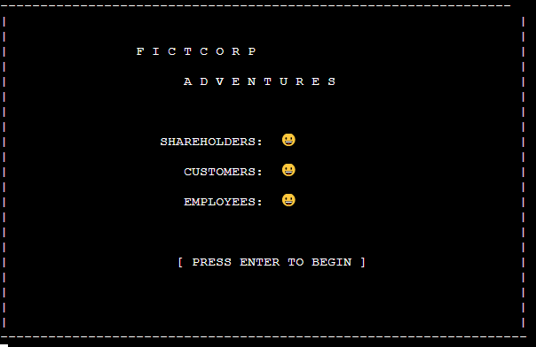

## - Game Rules / Instructions & Introductory Story Screen
The user is given an overview of the game rules & instructions via this feature, with the Typewriter effect being used to display the text on serving the purpose of both adding to the UX by giving the introduction a more cinematic feel, and also helps the user to visually parse the information by displaying it gradually/piecemeal rather than overwhelm the user with one large block of text:

## - Performance Dashboard
An integral feature of the game is the performance dashboard. This feature is used to display to the user their progress, both in terms of the financial snapshot of the company's revenue, costs, and profits, as well as the key stakeholders and their current sentiment, represented via emojis on a scale of -2 to +2, with 0 being neutral

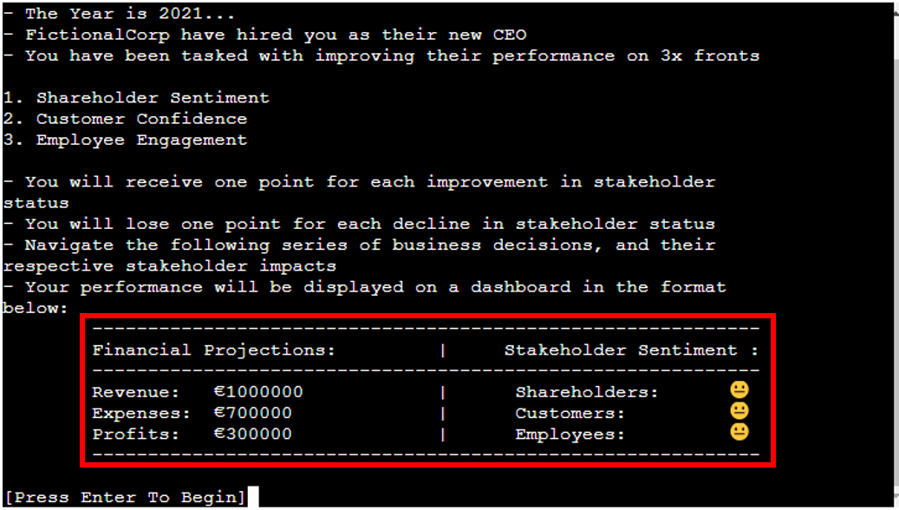

### - Financial Projections
This section of the dashboard feature will display the projected financial data for the company's year ahead - revenue, costs and profits, as well as any impact the user's decisions have upon these projections

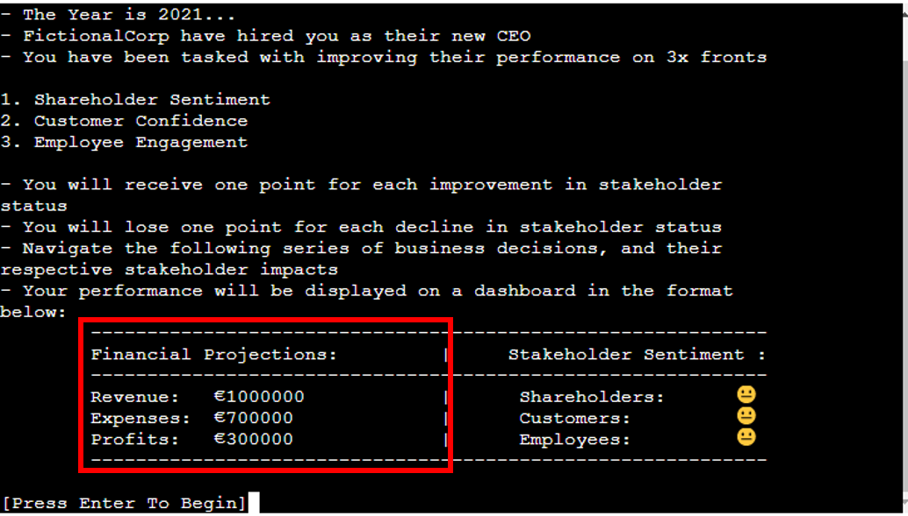

### - Stakeholder Sentiment
This section of the dashboard feature will display a snapshot of the sentiment of the company's key stakeholders - shareholders, employees and customers - with an emoji for each to give a visual representation of the stakeholder's satisfaction level. The impact of the user's decisions will cause changes in the stakeholder's sentiment levels, and the user will recieve points for positive changes and will lose points for negative changes

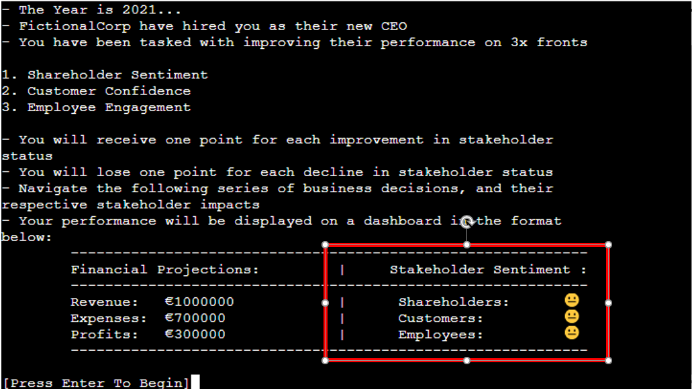

### - Dashboard Deltas - Financial & Stakeholders
The "Delta" sections of the dashboard are an integral feature of the game, helping keep the user informed from decision to decision as to the results of their particular course of action on the financial status & stakeholder sentiment levels. The change in Revenue, Costs, and profits versus the prior dashboard are shown to the right of the metrics, and similarly for the shareholders, customers, and employees current satisfaction levels - both illustrated in the screenshot below:

## - Cumulative Score Tracking
This feature will track the user's score as they move through each question. Any points the user gains/loses from their proposed courses of action will be cumulatively tracked and displayed here.

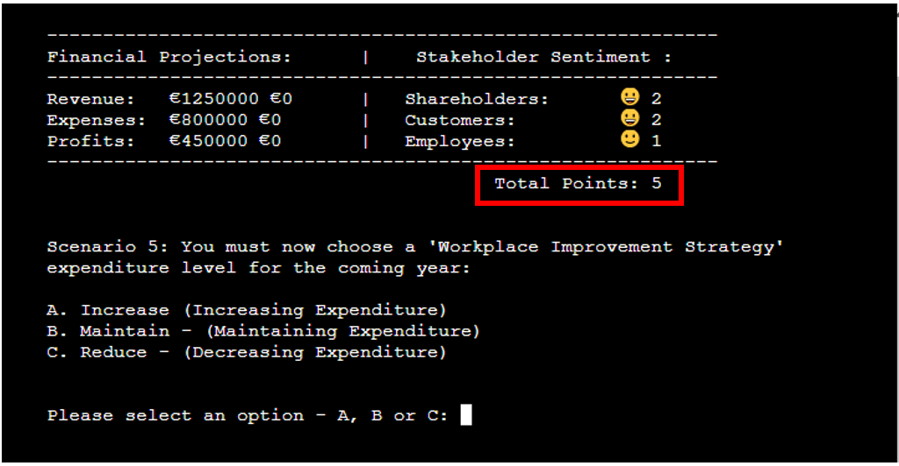

## Scenario 1:
This is the first scenario the user must navigate, and involves making a decision on the selling price for the company's leading product. You can see from the dashboard snapshot that all metrics both financial and stakeholder-related are at their default values. The user must choose between option A, B or C and will then be shown the impact of their decision on both the company financials, and stakeholder sentiment.

The section below details the possible decision paths the user can take through scenario one:

If the user selects answer A for example, it will have an overall negative effect on the company's financial status & stakeholder sentiment. Customers will be dissatisfied with the increased prices they have to pay, and will look elsewhere for alternatives, cauing a net decrease in revenues. This will knock on into reduced profits, which will also cause shareholder sentiment to decline. 

Answer B will have no material effect on current financials or stakeholder sentiment, and will award/deduct zero points as a result.

Whereas Answer C will lead to an award of a single point to the user as a result of managing to improve revenues (increasing shareholder status) without losing any employee or customer sentiment

### - Answer A

### - Answer B

### - Answer C

In all cases, the user's closing points score from scenario one will carry forward to the next scenario for the user and will be reflected in their opening dashboard for scenario two - detailed in the next section below:

## Scenario 2:
This is the second scenario the user must navigate, and involves making a decision on the marketing budget for the year ahead. The opening dashboard snapshot will show the snapshot carried forward from scenario one for all metrics across financial and stakeholder sentiment (In this case the user has selected option A for Scenario one, leading to an opening score of -2) 

The user must again choose between option A, B or C before being shown the impact of their decision on the closing dashboard display to be carried forward to scenario 3

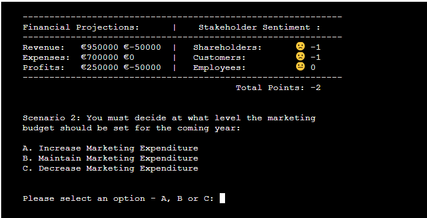

In terms of the possible decision paths through scenario two - If the user selects answer A, it will have an overall positive effect on the company's financial status & stakeholder sentiment. Customer satisfaction will be increased with the additional marketing efforts causing the customer base to expand, driving a net increase to profits after accounting for the increased marketing costs, leading to an increase in shareholder sentiment level. Overall this will give the user a score of +2 points

Answer B will again have no material effect on current financials or stakeholder sentiment, with no change to current plans, and will award/deduct zero points as a result.

Whereas Answer C will lead to a deduction of two points (shareholders and customers) due to decreased units sold reducing revenues which is a negative for shareholders, and also a negative for customers, as they decide to take their business elsewhere in light of the reduced marketing expenditure relative to competitors

### - Answer A
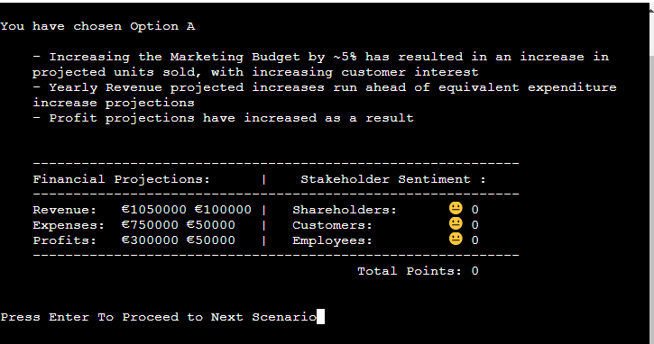

### - Answer B
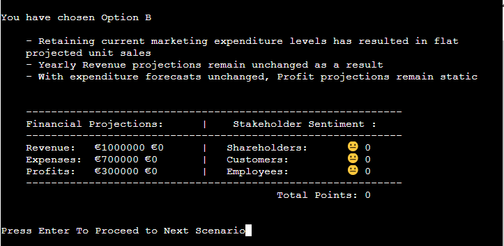

### - Answer C
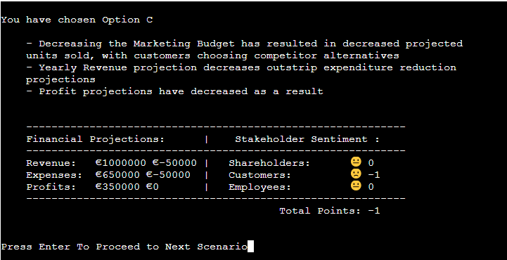

As usual - per the game mechanics, in all cases, the user's closing points score from scenario two will carry forward to the next scenario for the user and will be reflected in their opening dashboard for scenario three - detailed in the next section below:

## Scenario 3:
In this scenario the user must decide on a rate to negotiate for material supply prices. The opening dashboard snapshot will show the snapshot carried forward from scenario two for all metrics across financial and stakeholder sentiment. However, please note that for the purposes of the readme not all of the opening dashboards will be linearly sequenced in order to illustrate each of the possible decision paths through each question - here for example the user is starting from a score of zero - which reflects having chosen option B for both scenario one and two. 

As always, the user must again choose between option A, B or C before being shown the impact of their decision on the closing dashboard display to be carried forward to scenario 4

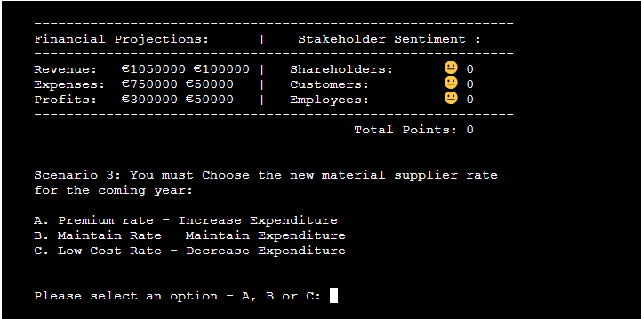

In terms of the possible decision paths through scenario three - If the user selects answer A, it will have an overall positive effect on the company's financial status & stakeholder sentiment. Employees in this case are happy that they are now working with a higher quality of material, and customers are also happy that the build quality of their product has improved. However there is no positive score in this case for shareholders due to the lack of progress in terms of revenues, costs or profits. Overall this will give the user a score of +2 points

Answer B will again have no material effect on current financials or stakeholder sentiment, with no change to current plans, and will award/deduct zero points as a result.

Similarly, Answer C will also lead to a net zero points score due to customer dissatisfaction with the new low cost, but low quality materials, offsetting the positive sentiment generated amongst shareholders from the increased profit driven by the reduced costs of manufacture.

### - Answer A

### - Answer B

### - Answer C
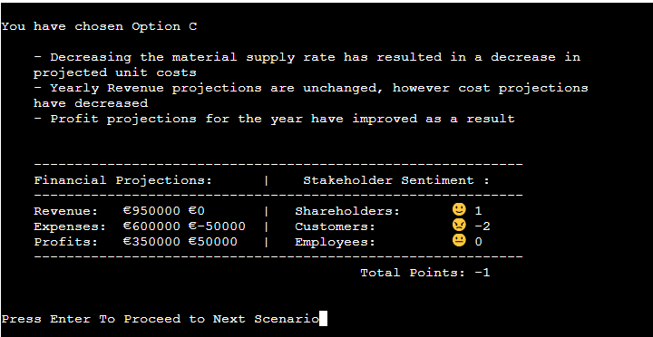

As usual - per the game mechanics, in all cases, the user's closing points score from scenario three will carry forward to the next scenario for the user and will be reflected in their opening dashboard for scenario four - detailed in the next section below:

## Scenario 4:
In this scenario the user must decide on setting the coming year's employee payroll budget, and as standard, the user must choose between option A, B or C before being shown the impact of their decision on the closing dashboard display to be carried forward to the final scenario:

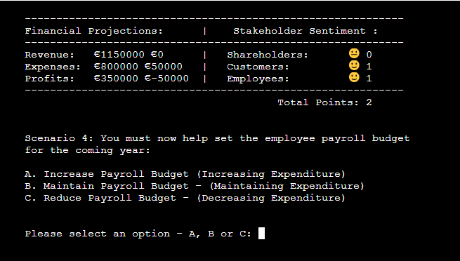

In terms of the possible decision paths through this scenario - If the user selects answer A, it will have an overall net positive effect of +1 on the company's financial status & stakeholder sentiment. Employees in this case very are happy that they have increased salaries (adding +2 points to the user's score), but shareholders are causing a single point deduction due to the negative impacts on costs dialling through to reduced profits. 

Answer B will again have no material effect on current financials or stakeholder sentiment, with no change to current plans, and will award/deduct zero points as a result.

Similarly, Answer C will also lead to a net zero points score due to employee dissatisfaction with the new lower payroll budget, offsetting the positive sentiment generated amongst shareholders from the increased profit driven by the reduced costs of goods sold.

### - Answer A

### - Answer B
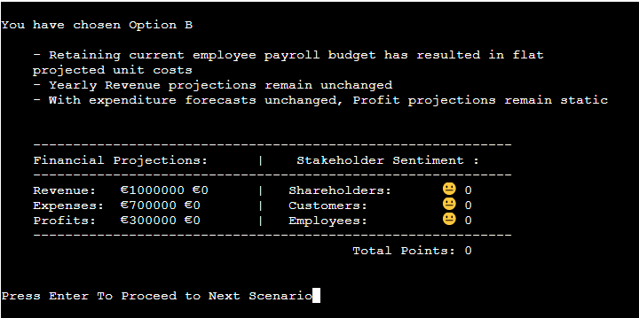
### - Answer C
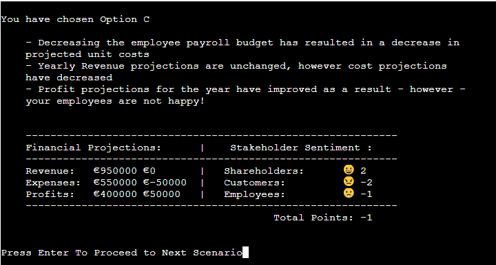

As usual - per the game mechanics, in all cases, the user's closing points score from scenario four will carry forward to the next scenario for the user and will be reflected in their opening dashboard in the final scenario - detailed in the next section below:

## Question 5:

In this final scenario the user must decide on setting a budget for the upcoming "Workplace Improvement Strategy" and as standard, the user must choose between option A, B or C before being shown the impact of their decision on the closing dashboard display:

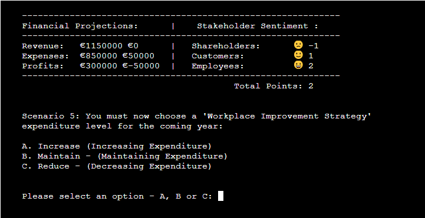

In terms of the possible decision paths through this scenario - If the user selects answer A, it will have an overall net effect of +1 point to the company's financial status & stakeholder sentiment. Employees in this case are again very happy that they have an improved workplace environment (+2 points), but shareholders are causing a points deduction due to the negative impacts on costs dialling through to reduced profits. 

Answer B will again have no material effect on current financials or stakeholder sentiment, with no change to current plans, and will award/deduct zero points as a result.

Similarly, Answer C will also lead to a net zero points score due to employee dissatisfaction with the reduced investment in the workplace, offsetting the positive sentiment generated amongst shareholders from the increased profit driven by the reduced costs of goods sold.

### - Answer A
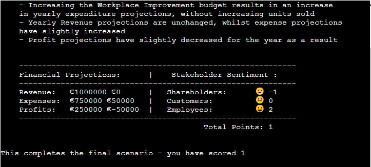
### - Answer B

### - Answer C

With this being the final scenario, there is no carry-forward to another dashboard, with the user instead being presented with their cumulative total score, and the option to either play again to try to improve this score by investigating the impact of alternate decision paths through the game, or if they wish to exit the game, they can now do so.

Both of these final features are detailed below:

## - Final Score Display

Here you can see the feature displaying to the user their final cumulative score resulting from the decision path they have chosen through the game, displayed together with a notificaiton to confirm to the user that they have completed all of the required scenarios and decisions:

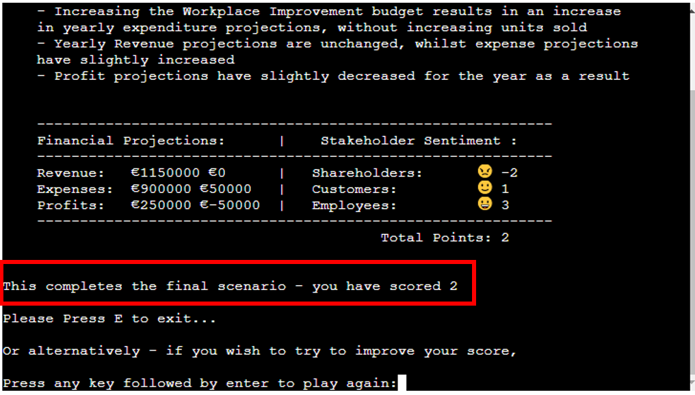

## - Exit Game/Play Again Menu

Finally - this feature will display upon conclusion of the game, and will give the user the option of either trying to beat their previous score by navigating a different decision path through the game, or alternatively they can now exit the game if they wish, by pressing "E" followed by enter, which will return them to the Python Games Package main menu.

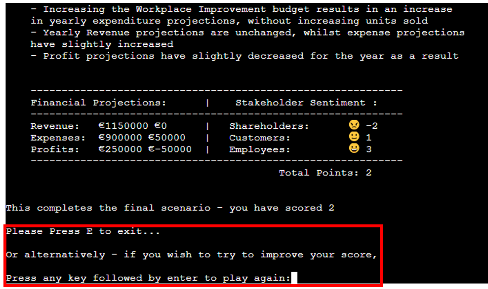

## **Features Left To Implement:**
----

In addition to the existing features, there were several additional features which could be added to the FictCorp Adventures application in future and are yet to be implemented - each of which are detailed below:

### - Extended Question Bank:
In an unconstrained environment, I would like to add many additional questions and scenarios to the existing five scenarios which would add more color & depth to the User Experience investigating many different areas of the business and stakeholder sentiment. However, with project deadlines I have decided to leave an extended question bank out of scope for this release in the spirit of having a Minimum Viable Product (MVP) for project deadlines.

### - Random question Selection:
In conjunction with the extended question bank above, it would be a potential additional feature for future releases of the game to add in a random selector for each question adding an element of variety and chance to the game to help with the User Experience. This would mean each time the User loads the game, they will not know which questions/scenarios will appear, and which sequence the questions will appear in.

### - Game length Control:
This would also be a possible feature whereby the user can select a quick game (3x scenarios), a standard game (5x scenarios) or an extended game (7x scenarios) depending on their wishes and time availability. This would work in combination with the extended question bank, and random question generation features above.
