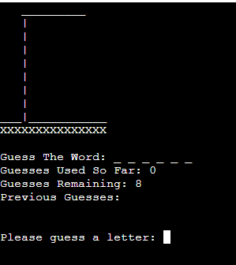
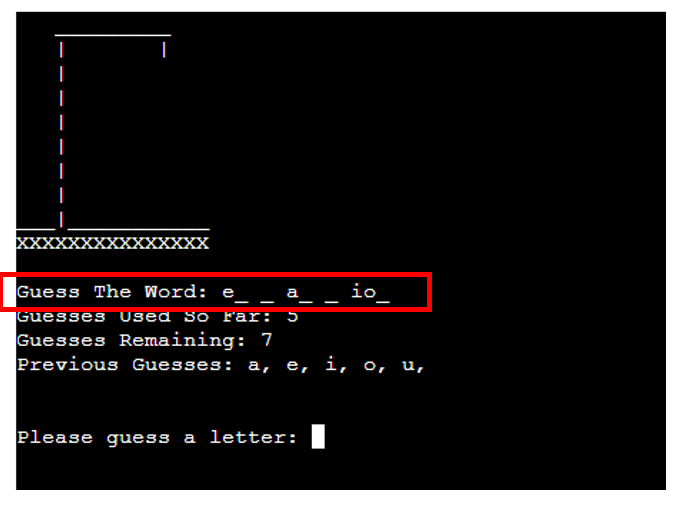
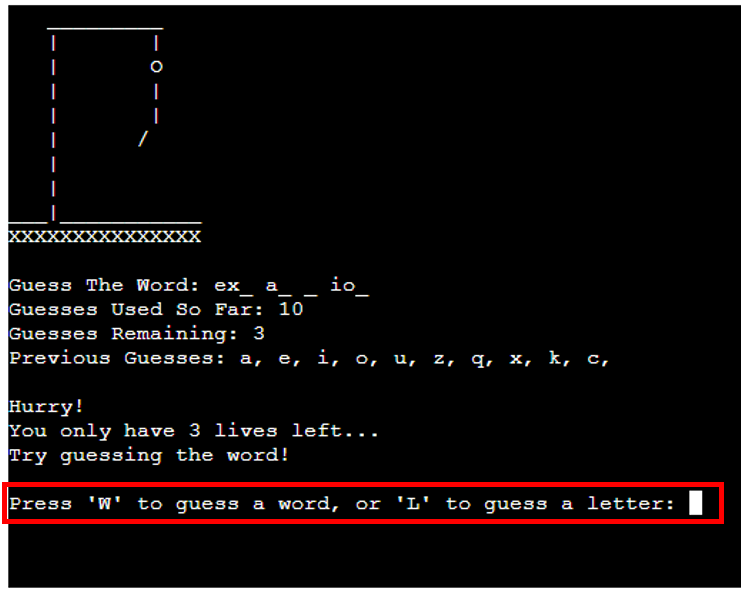
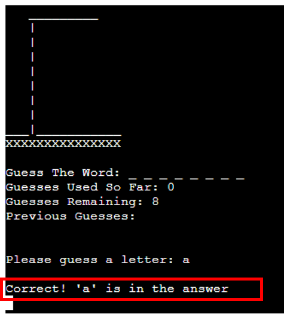
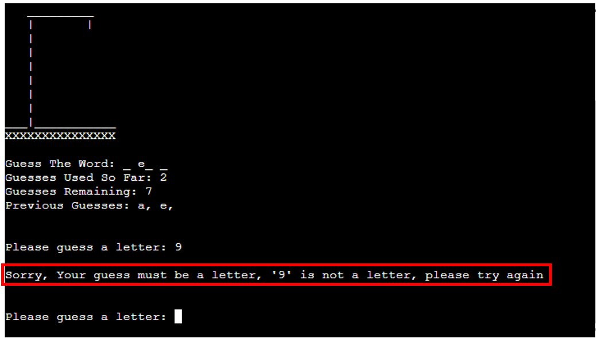
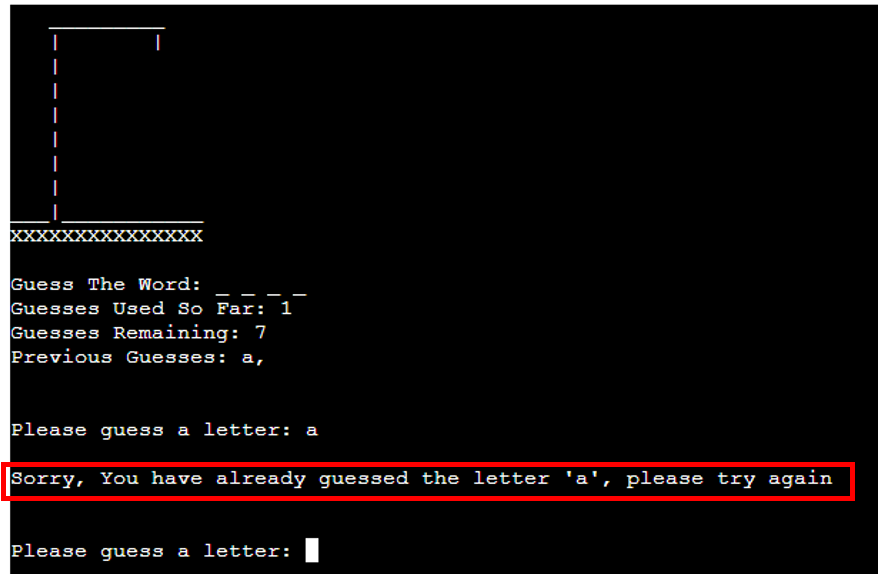
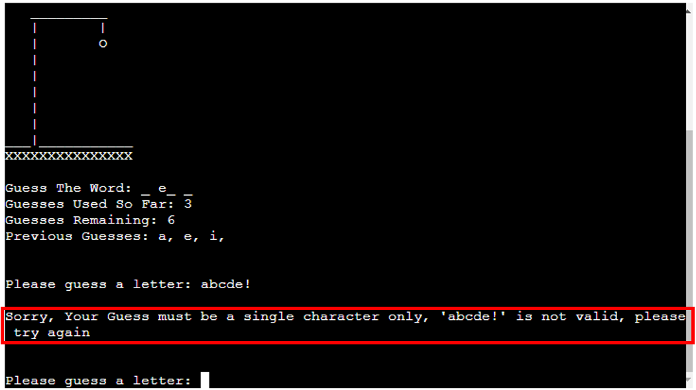
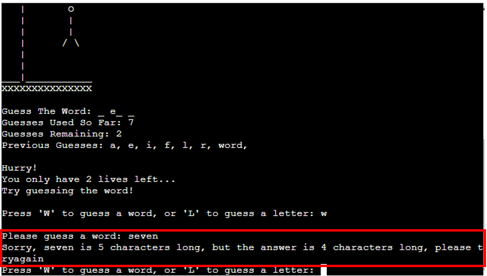
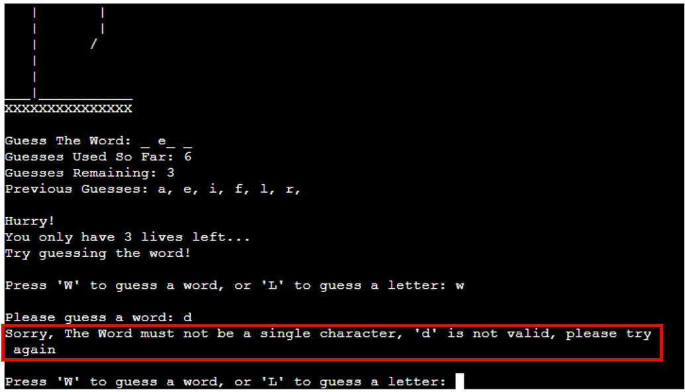
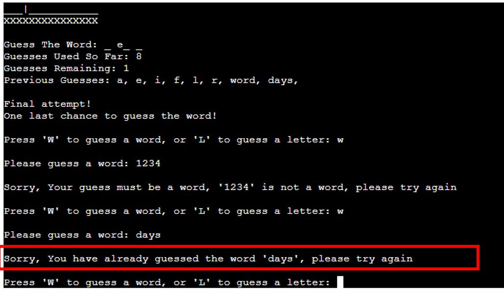

# **Hangman Features**
The following section details the features specific to the "Hangman" component of the application:

## **Existing Features**:
----

### - Word Bank:
The library of words for the game is contained in the file "words.txt", and is imported into the main run.py Python file. I found this approach enabled the best user experience in that it gave a very large selection of words of varying lengths and difficulties to keep the game interesting for the User/s. The source is attributed & detailed in the credits section.

### - Hangman Welcome Screen:
This is the initial introductory screen greeting the user upon selection of the Hangman game from the game selection menu

### - Main Game Screen:
The Main Game screen is where the user will play the game of Hangman. It contains several sub-elements/features each of which are shown in more detail below:

### - Gallows Feature:
The Gallows sits at the top of the main game screen, and acts as a visual representation of the player's quantity of incorrect guesses:

### - Answer Tracker:
The Answer tracking section of the main game screen will display a placeholder area on which the player's guesses will be compared to the answer - each time the player guesses a letter correctly, one of the blank slots will be displaced by the correct letter, continuing until either the player has ran out of guesses, or until the player has correctly guessed all the letters in the word:

### - Guess Counters:
There are two counting sections under the answer tracker, which will display to the user their progress in terms of how many guesses they have remaining, and how many guesses they have used in the game so far:

### - Previous Guesses Recording:
This feature will record each previous guess a player has entered, and display the previous guesses as a list of comma separated letters below the guess-counter section. This will aid the user in terms of avoiding double-guessing a letter, and not having to try remember a long list of previous guesses:

### - Guess entry prompt:
This is the key feature on the main game screen and is where the user will be prompted to enter their next guess at which letter may be contained in the answer:

### - Warning notification - guess count at three or less:
When the user reaches the point of having only three guesses remaining, this feature will activate, informing the user of their limited remaining guesses, and adding to the overall UX:

### - Guess Word or Letter functionality:
The reduction of the guesses remaining count down to three or less will also trigger the activation of a feature allowing the user to guess either the full word or a single letter, further adding to the UX:

### - Warning notification - final guess remaining:
When the user reaches the point of having only one guess remaining, this feature will activate, informing the user of their limited final chance to guess the answer, and adding to the overall UX:

### - Notification - Correct Guess:
The notification feature for correctly guessing a letter is shown below, note this is also used in conjunction with the "sleep" function (detailed further in the [credits](https://github.com/dkelly255/python-games-package#technologies--libraries-used) section) to help with delivering a positive UX by having the text appear & then disappear after a pre-programmed time limit.

### - Notification - Incorrect Guess:
The equivalent notification for when an incorrect letter has been guessed is shown below, note that similar to the "Correct Guess" notification, this is also used in conjunction with the "sleep" function (detailed further in the [credits](https://github.com/dkelly255/python-games-package#technologies--libraries-used) section) to help with delivering a positive UX by having the text appear & then disappear after a pre-programmed time limit.

### - Data-Validation - Non-Letter Warning:
The example below shows the warning feature displayed when a user has entered a guess that is not a letter:

### - Data Validation - Duplicate Letter Guess Warning:
A similar warning will be displayed if the user enters a letter that they have already guessed - this will trigger a duplicate entry warning to aid the user:

### - Data validation - Incorrect guess length warning (Letter)
This data validation feature warns the user when they have entered a guess that does not meet the letter length requirement (i.e. a single character), as part of the defensive design approach and dealing elegantly with incorrect data entry

### - Data validation - Incorrect guess length warning (Word)
Similarly, this data validation feature warns the user when they have entered a guess that does not meet the word length requirement (i.e. the guess must be the same length as the answer).

The warning will fire when the guess is either too long, or too short, as demonstrated in the screenshots below:

### - Data Validation - Non-Alpha word
This feature will ensure a warning message is displayed to the user in the event of trying to guess a word that contains non-alphabetic characters:

### - Data Validation - Duplicate Guess word
This feature will ensure a warning message is displayed to the user in the event of trying to guess a word that has already been guessed:

### - Game Won Notification:
The final type of notification to be displayed is the game conclusion - in the example below - the user has won, and the notification area will display a message confirmation:

### - Game Lost Notification:
In the event that the player loses the game, the message below will be displayed informing the user of the game conclusion:

### - Exit Game Prompt:
Upon conclusion of the game, this feature will provide the user with two options - they can either exit the application by pressing the "e" or "E" key, or they can choose to play another game by pressing any other key followed by the "Enter" key:

## **Features Left To Implement:**
----
In addition to the existing features, there were several additional features which could be added to the Hangman application in future and are yet to be implemented - each of which are detailed below:

### - Add Phrases to Answer Pool: 
An additional feature that could be added in future is for the user to have the option to "guess a phrase" instead of the default option of "guessing a word". It would add an extra dimension to the game and would contribute to a positive User Experience

### - Difficulty Level Settings:
Difficulty level setting could also be additional features in future - giving the user the ability to specify a difficulty level, which would be primarily be determined by the length of the word being guessed. For example - easier words would be of shorter length, with harder difficulty words being longer in length.

### - Guess limit extension/reduction:
The ability for the user to modify their guess limits would also be a potential future feature for the game - adding depth to the game by allowing higher and lower guess limits according to the user's personal choice.