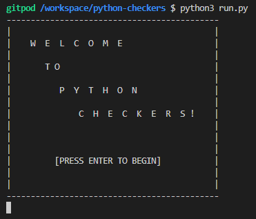
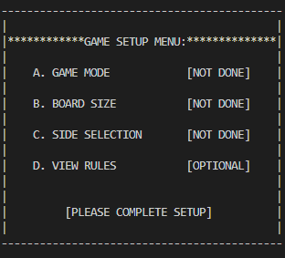
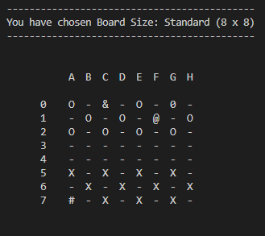
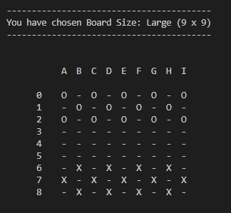
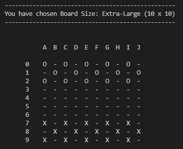

# Python Checkers (Work in progress)

Readme supporting Python Checkers application

# UX Planes
## Strategy
### - User Stories
## Scope
### - Wireframes
## Structure
## Skeleton
## Surface
Section addressing design process & User Experience Planes
# Features

## Existing Features
## Features Left To Implement
Section describing features of the application
# Testing
## Generic Testing
## Python Testing
## Accessibility Testing
Detail testing carried out for application development
# Bugs
## Resolved Bugs
## Unresolved Bugs
Detail bugs encountered during development - succesfully debugged & yet to be resolved
# Deployment
## Github
## Heroku
Explain deployment processes - local & global
# Credits
## Content
## Code
## Media
List sources & resources used to develop the application 