# Python Hangman (Work in progress)

This Readme documentation supports the application game "Hangman" created using Python, and played in the terminal

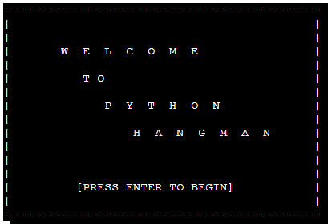

# UX Planes

I have used the Five Planes of UX to design the application, and provide a description of the acitvities, connections, and flows through each of the UX Planes below:
## Strategy
In terms of User Stories - As a user I would like to be able to:
- Play a game of Hangman against the computer 
- Be able to see my progress through the game in terms of guesses used, guessed remaining and answer letters revealed
- Have the option to either exit the game or play again upon completing a game
 
## Scope
To facilitate & guide the design of the application, I created a flowchart using Microsoft Excel to map the flow control and activity sequencing throughout the game. The Flowchart below shows the overflow of the application logic & flow:
### - Wireframe & Flowchart

## Structure
## Skeleton
## Surface

# Features
## Existing Features:
### Welcome Screen:
The welcome screen greets the user upon loading the game and will load the actual game upon pressing the "Enter" Key

### Main Game Screen:
The Main Game screen is where the user will play the game of Hangman. It contains several sub-elements/features each of which are shown in more detail below:

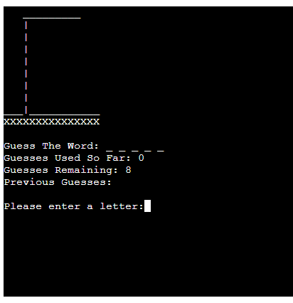

### Gallows Feature:
The Gallows sits at the top of the main game screen, and acts as a visual representation of the player's quantity of incorrect guesses:

### Answer Tracker:
The Answer tracking section of the main game screen will display a placeholder area on which the player's guesses will be compared to the answer - each time the player guesses a letter correctly, one of the blank slots will be displaced by the correct letter, continuing until either the player has ran out of guesses, or until the player has correctly guessed all the letters in the word:

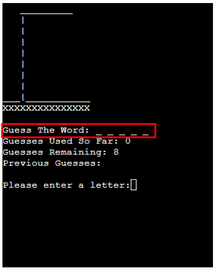

### Guess Counters:
There are two counting sections under the answer tracker, which will display to the user their progress in terms of how many guesses they have remaining, and how many guesses they have used in the game so far:

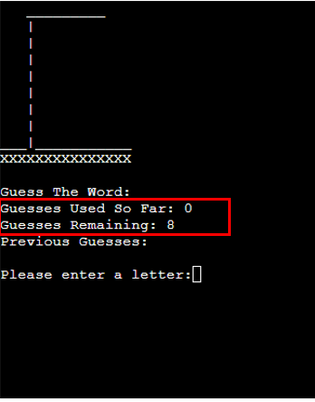

### Previous Guesses Recording:
This feature will record each previous guess a player has entered, and display the previous guesses as a list of comma separated letters below the guess-counter section. This will aid the user in terms of avoiding double-guessing a letter, and not having to try remember a long list of previous guesses:

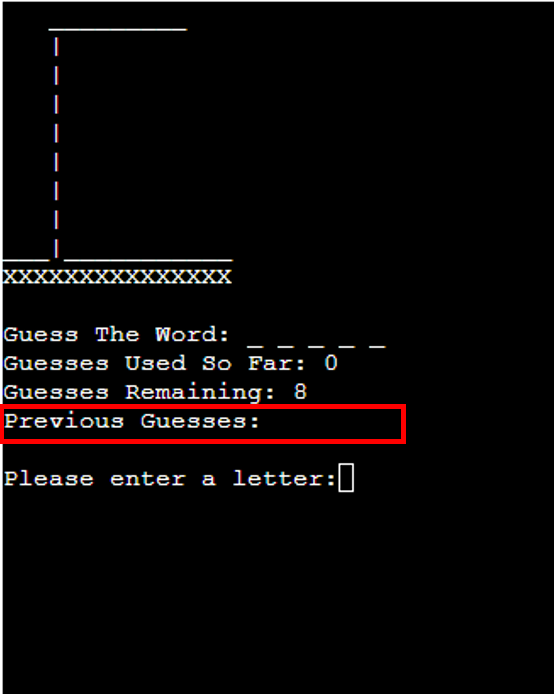

### Guess entry prompt:
This is the key feature on the main game screen and is where the user will be prompted to enter their next guess at which letter may be contained in the answer:

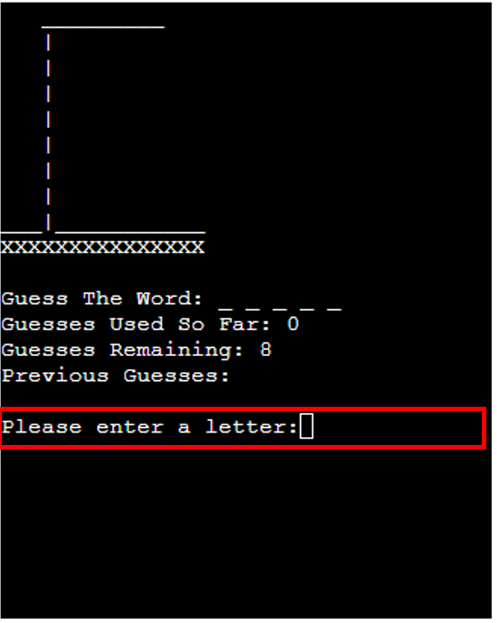

### Notification Area - Correct Guess:
The notification area is located above the Answer Tracker section, and will contain various notifications to aid the user as the progress through the game. The notification for correctly guessing a letter is shown below:

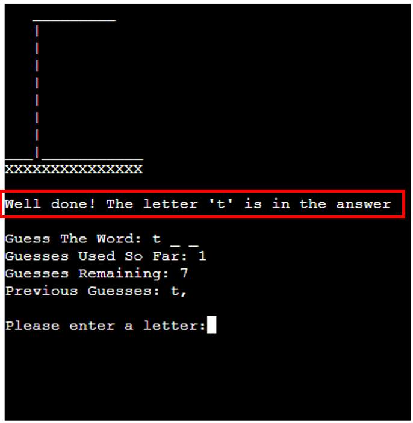

### Notification Area - Incorrect Guess:
The equivalent notification for when an incorrect letter has been guessed is shown below:

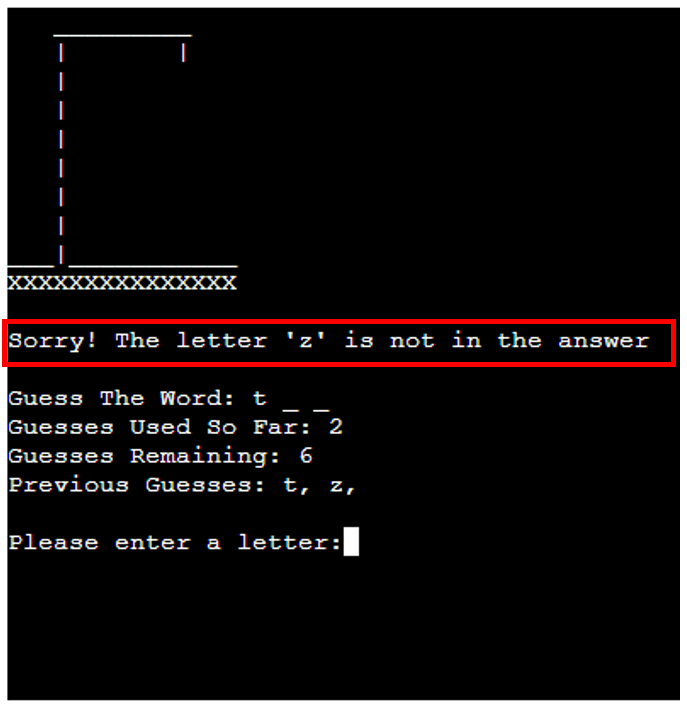

### Notification Area - Non-Letter Warning:
In addition to notifying the user of correct/incorrect guesses - the notification area will also display a warning to the user in the event of incorrect data entry. The example below shows a warning displayed when a user has entered a guess that is not a letter:

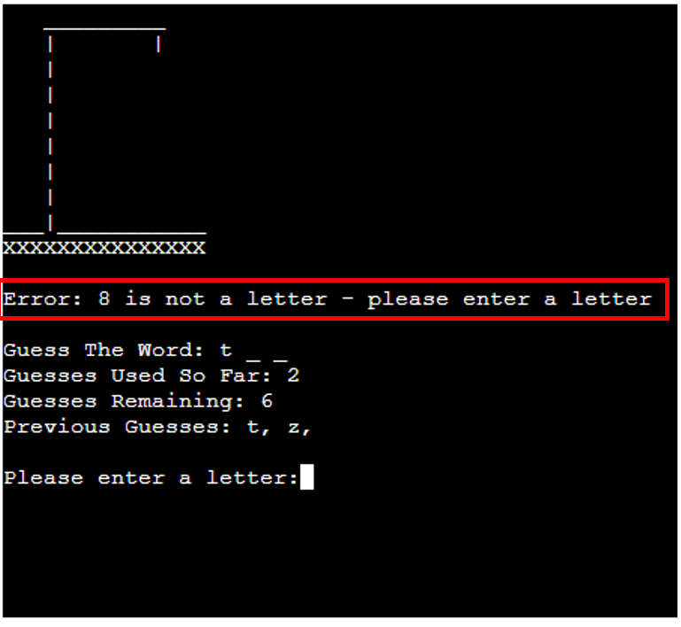

### Notification Area - Duplicate Guess Warning:
A similar warning will be displayed in the notification area if the user enters a letter that they have already guessed - this will trigger a duplicate entry warning to aid the user:

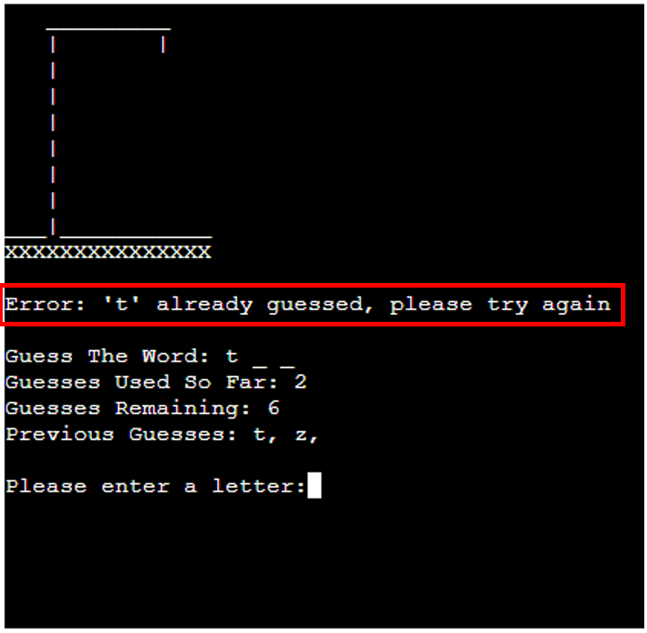

### Game Won Notification:
The final type of notification to be displayed in this feature is the game conclusion - in the example below - the user has won, and the notification area will display a message confirmation:

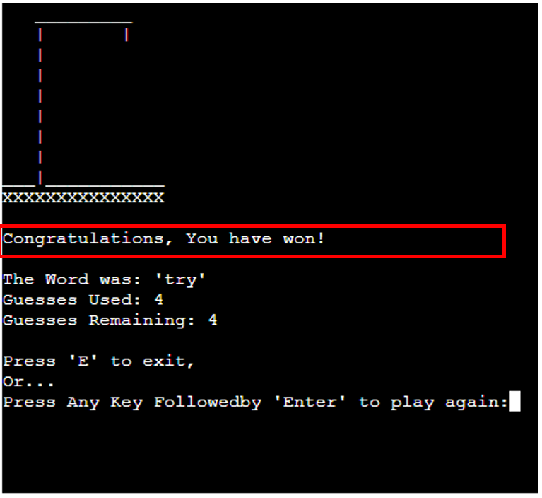

### Game Lost Notification:
In the event that the player loses the game, the notification area will display the message below informing the user of the game conclusion:

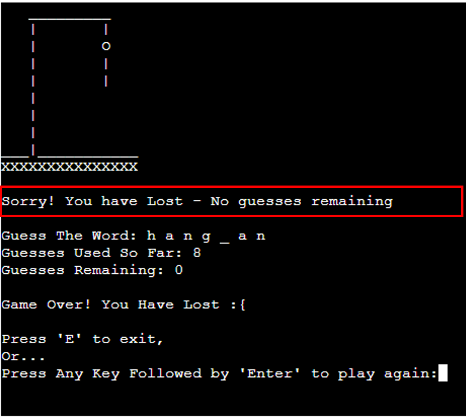

### Exit Game Prompt:
Upon conclusion of the game, this feature will provide the user with two options - they can either exit the application by pressing the "e" or "E" key, or they can choose to play another game by pressing any other key followed by the "Enter" key:

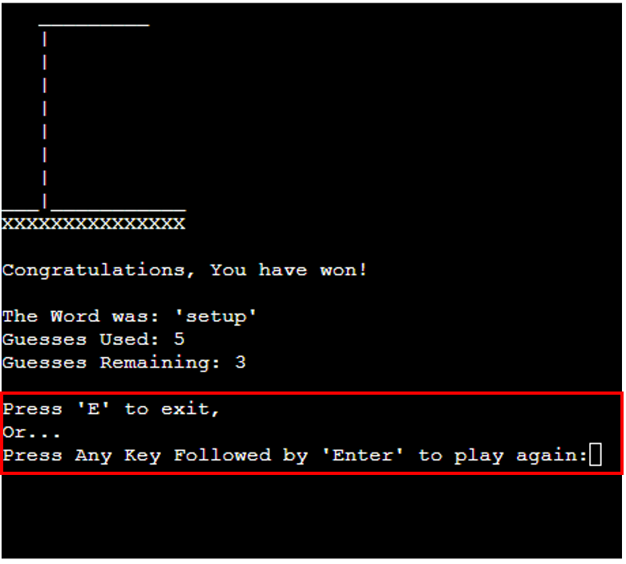

## Features Left To Implement
There were several additional features which could be added to the Hangman application - each of which are detailed below:

### Guess Word Functionality
This would add a feature to the game whereby the user would have the option to "guess the word" at any point in the game, rather than continuing to guess individual letters. It would save the user time, and would add an element of risk to the game if accompanied by an "automatic fail" if the user guesses the wrong word, triggering the game lost screen.

### Add Phrases to Answer Pool 
An additional feature that could be added in future is for the user to have the option to "guess a phrase" instead of the deafult option of "guessing a word". It would add an extra dimension to the game and would contribute to a positive User Experience

### Difficulty Level Settings
Difficulty level setting could also be additional features in future - giving the user the ability to specifiy a difficulty level, which would be primarily be determined by the length of the word being guessed. For example - easier words would be of shorter length, with harder diffuclty words being longer in length.

### Guess limit extension/reduction
The ability for the user to modify their guess limits would also be a potential future feature for the game - adding depth to the game by allowing higher and lower guess limits according to the user's personal choice.

# Testing
## Generic Testing
## Python Testing
I have used the PEP8 Python code validation service to test my program and the code has passed without any errors, notifications or warnings as shown in screenshot below:

## Accessibility Testing
Detail testing carried out for application development
# Bugs
## Resolved Bugs
## Unresolved Bugs
Detail bugs encountered during development - succesfully debugged & yet to be resolved
# Deployment
## Github
## Heroku
Explain deployment processes - local & global
# Credits
## Content
## Code
## Media
List sources & resources used to develop the application 