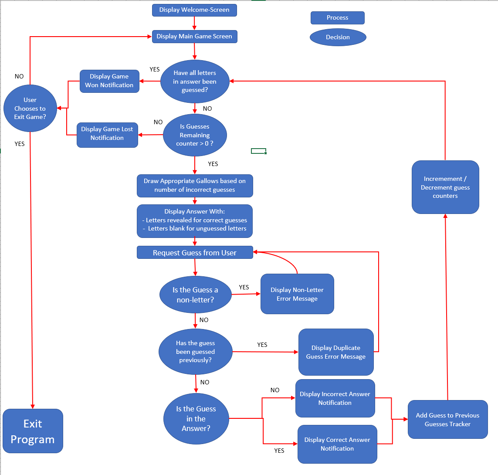
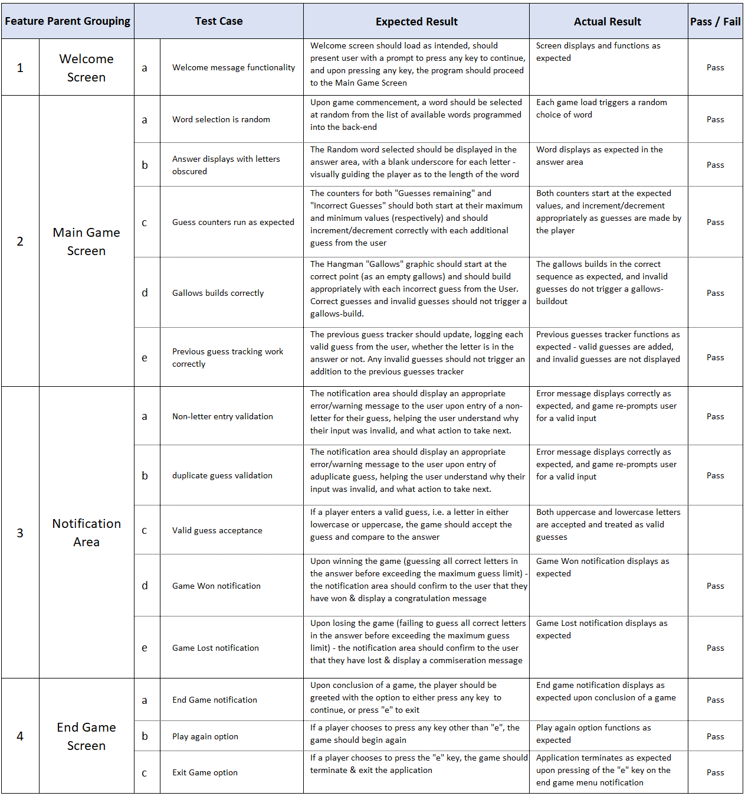
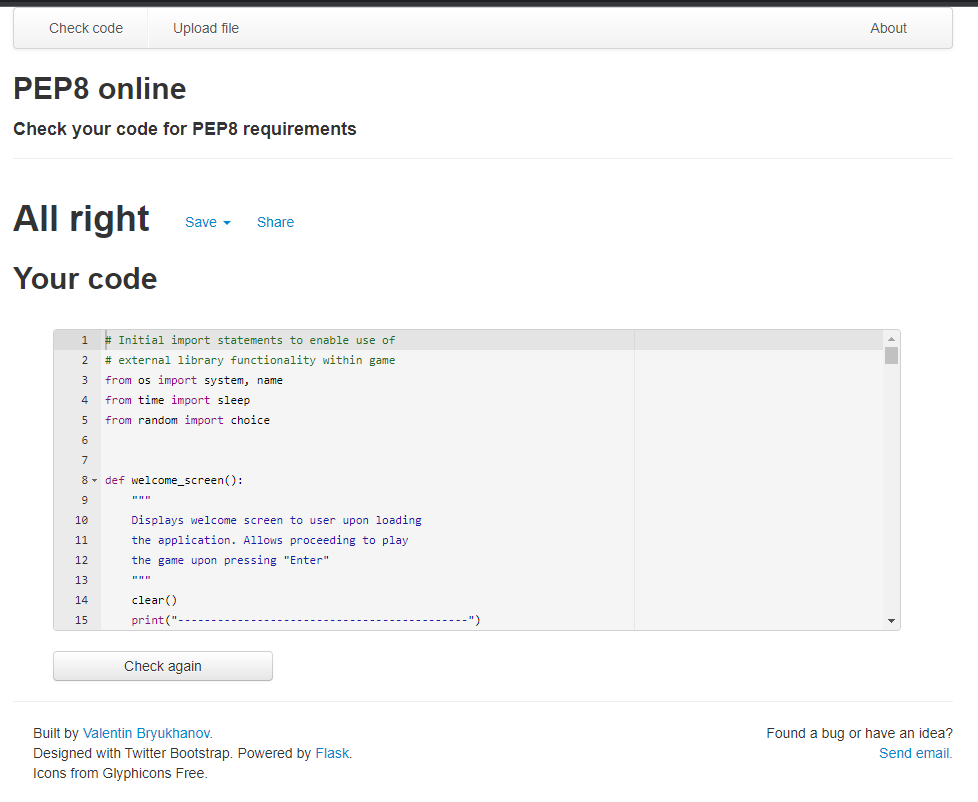

# Python Games Package 

This Readme documentation supports the application "Python Games Package" created using Python, and designed to be played in the terminal 

The application will allow the user the choice of playing either the word-guessing game "Hangman", or a text adventure-style game called "FictCorp Adventures" where the user must navigate a series of business decisions as the new CEO of a fictional corporation

# UX Planes

I have used the Five Planes of UX to design the application, and provide a description of the acitvities, connections, and flows through each of the UX Planes below:
## Strategy
The strategy for the application's User Experience was developed around addressing the User Needs and User Stories below - users will wish to:
- Have the ability to play a game of Hangman against the computer 
- See their progress through the game in terms of guesses used, guessed remaining and answer letters revealed
- Have the option to either exit the game or play again upon completion of an individual game
 
## Scope
The Scope of the application is informed by the Strategy above, in terms of the Functional Specifications and Requirements of the game - I wanted to ensure optimal scope to actualise the strategy by including content and interactivity that help enable the user stories.

The site's scope encompasses the provision of a fully functional hangman game to the user, with features that would appropriately deliver the user experience - including a drawable gallows, guess tracking/counting functionality, an answer display, and a suite of situational notifications to help guide the user through the game experience

I have also demarcated the original possible list of site scope into "existing features" and "features yet to implement" in the next section of this readme document - with the former containing the final features of the live site in the spirit of ensuring a Minimum Viable Product (MVP) that would meet project deadlines

## Structure

The application is delivered via a simple 2-page structure, with the first page containing the welcome message that greets the user upon initialising the game, and the second page housing the actual game content & interface.

As detailed further in the "Features" section below, the main game page is a one-stop-shop delivering all of the user needs in one self-contained area - including everything from the gallows displaying the game progress, to guess counters, to answer tracking and a notification area.

Based upon the site Strategy & Scope laid out above, I felt that this simple but effective structure would represent the optimal way of delivering the User Experience in a positive and effective manner

## Skeleton

To facilitate & guide the design of the application and User Experience, I created a flowchart using Microsoft Excel to map the game's flow control and activity sequencing throughout the stages of play. 

The Flowchart below shows the macro-level flow of the application logic & flow, with rectangular containers representing processing steps, and circular containers representing decision points where the program will take a different path depending on specific circumstances:
### - Wireframe & Flowchart

## Surface
Finally, the evolution of the first four Planes of User Experience above allowed the Surface Plane to take shape in terms of arriving at the visual look & feel of the application to be expereienced by the User

The Application is delivered via the Python terminal, which immediately sets several structural boundaries & constraints in terms of screen length (24 rows) and screen width (80 characters) 

Working within these boundaries I found that a simple series of border frames for the welcome screen, combined with appropriate line breaks & new lines on the main game screen would deliver the most visually pleasing surface Plane for the user's experience when playing. 

These Surface elements are discussed & illustrated in further detail in the "Features" section below

# Features
The main features of the application are discussed in detail below - I have segregated the features into two sections - "Existing Features" and "Features Left To Implement" with screenshots and narrative descriptions where appropriate:
## Existing Features:

### Welcome Screen:
The welcome screen greets the user upon loading the game and will load the game selection screen upon pressing the "Enter" Key

### Game Selection Screen:
The game selection screen allows the user to either choose a game to play, or to exit the applciation and will load the user's choice based upon pressing either key "A", "B", or "C" followed by the "Enter" Key

### Hangman Features:
The following section details the features specific to the "Hangman" component of the application:

### Hangman Welcome Screen:
This is the initial introductory screen greeting the user upon selection of the Hangman game from the game selection menu

### Main Game Screen:
The Main Game screen is where the user will play the game of Hangman. It contains several sub-elements/features each of which are shown in more detail below:

### Gallows Feature:
The Gallows sits at the top of the main game screen, and acts as a visual representation of the player's quantity of incorrect guesses:

### Answer Tracker:
The Answer tracking section of the main game screen will display a placeholder area on which the player's guesses will be compared to the answer - each time the player guesses a letter correctly, one of the blank slots will be displaced by the correct letter, continuing until either the player has ran out of guesses, or until the player has correctly guessed all the letters in the word:

### Guess Counters:
There are two counting sections under the answer tracker, which will display to the user their progress in terms of how many guesses they have remaining, and how many guesses they have used in the game so far:

### Previous Guesses Recording:
This feature will record each previous guess a player has entered, and display the previous guesses as a list of comma separated letters below the guess-counter section. This will aid the user in terms of avoiding double-guessing a letter, and not having to try remember a long list of previous guesses:

### Guess entry prompt:
This is the key feature on the main game screen and is where the user will be prompted to enter their next guess at which letter may be contained in the answer:

### Warning notification - guess count at three or less:
When the user reaches the point of having only three guesses remaining, this feature will activate, informing the user of their limited remaining guesses, and adding to the overall UX:

### Guess Word or Letter functionality:
The reduction of the guesses remaining count down to three or less will also trigger the activiation of a feature allowing the user to guess either the full word or a single letter, further adding to the UX:

### Warning notification - final guess remaining:
When the user reaches the point of having only one guess remaining, this feature will activate, informing the user of their limited final chance to guess the answer, and adding to the overall UX:

### Notification - Correct Guess:
The notification feature for correctly guessing a letter is shown below:

### Notification - Incorrect Guess:
The equivalent notification for when an incorrect letter has been guessed is shown below:

### Data-Validation - Non-Letter Warning:
The example below shows the warning feature displayed when a user has entered a guess that is not a letter:

### Data Validation - Duplicate Letter Guess Warning:
A similar warning will be displayed if the user enters a letter that they have already guessed - this will trigger a duplicate entry warning to aid the user:

### Data validation - Incorrect guess length warning (Letter)
This data validation feature warns the user when they have entered a guess that does not meet the letter length requiremenet (i.e. a single character), as part of the defensive design approach and dealing elegantly with incorrect data entry

### Data validation - Incorrect guess length warning (Word)
Similarly, this data validation feature warns the user when they have entered a guess that does not meet the word length requiremenet (i.e. the guess must be the same length as the answer).

The warning will fire when the guess is either too long, or too short, as demonstrated in the screenshots below:

### Data Validation - Non-Alpha word
This feature will ensure a warning message is displayed to the user in the event of trying to guess a word that contains non-alphabetic characters:

### Data Validation - Duplicate Guess word
This feature will ensure a warning message is displayed to the user in the event of trying to guess a word that has already been guessed:

### Game Won Notification:
The final type of notification to be displayed is the game conclusion - in the example below - the user has won, and the notification area will display a message confirmation:

### Game Lost Notification:
In the event that the player loses the game, the message below will be displayed informing the user of the game conclusion:

### Exit Game Prompt:
Upon conclusion of the game, this feature will provide the user with two options - they can either exit the application by pressing the "e" or "E" key, or they can choose to play another game by pressing any other key followed by the "Enter" key:

## Features Left To Implement
There were several additional features which could be added to the Hangman application - each of which are detailed below:

### Guess Word Functionality
This would add a feature to the game whereby the user would have the option to "guess the word" at any point in the game, rather than continuing to guess individual letters. It would save the user time, and would add an element of risk to the game if accompanied by an "automatic fail" if the user guesses the wrong word, triggering the game lost screen.

### Add Phrases to Answer Pool 
An additional feature that could be added in future is for the user to have the option to "guess a phrase" instead of the deafult option of "guessing a word". It would add an extra dimension to the game and would contribute to a positive User Experience

### Difficulty Level Settings
Difficulty level setting could also be additional features in future - giving the user the ability to specifiy a difficulty level, which would be primarily be determined by the length of the word being guessed. For example - easier words would be of shorter length, with harder diffuclty words being longer in length.

### Guess limit extension/reduction
The ability for the user to modify their guess limits would also be a potential future feature for the game - adding depth to the game by allowing higher and lower guess limits according to the user's personal choice.

# Testing

## User Acceptance Testing (UAT)
In order to thoroughly test the functionality of my application, I sought out resources online in terms of approaches & techniques for effective User Acceptance Testing.

I found the below article from [Guru99](https://www.guru99.com/download-sample-test-case-template-with-explanation-of-important-fields.html) to be particularly applicable to my use-case scenario, and have modified their approach & template to better fit my specific application scenarios - with each test case detailed below

## Validator Testing
I have used the PEP8 Python code validation service to test my program and the code has passed without any errors, notifications or warnings as shown in screenshot below:

# Bugs
The following section will provide detail & context in terms of the debugging exercises that were part of the development process.

## Resolved Bugs
- Notification Area Display Spacing - Originally the notification area prompts were being punctuated by large blank spaces resulting in a bugged display to the user. Upon investigation I found that this was triggered partly by my reflection of the Initial round of PEP8 code validation feedback whereby I had extended code onto new lines without the accompanying new line separator - this resolved the bug & closed the issue

- Incorrect Gallows build sequencing - Initially I found that the Gallows was building incorrectly for the user when they have logged an incorrect guess - following a debugging exercise I realised this was due to the gallows function being triggered by the number of guesses remaining, rather than by an incorrect guess & was able to resolve the bug.

- Erroneous Previous guess logging - In the early stages of development, I found that the "Previous Guess" log section of the main game screen would collect up all guesses entered by the user, whether the guesses were valid or not - for example strings of text longer than one character, or numbers and numbers were all logged as previous guesses rather than prohibited. I was able to resolve this following a debugging exercise and improve the data entry validation & controls along with associated warning/error notifications.

## Unresolved Bugs
- There were no bugs of note left to report in the final version of the application deployed to Heroku (Details on the deployment are covered in the next section below)

# Deployment
The application was deployed via the "Heroku" service, and the link to the live deployment can be found by clicking [here](https://python-checkers.herokuapp.com/)

An extended list of detailed steps & instructions for deployment follows in the section below:

## Github
Note - please ensure you have created a github repository prior to proceeding to the "Heroku" deployment section below to ensure no rework or deployment issues
## Heroku
The Steps for deployment to Heroku are as follows:
- Navigate to [Heroku](https://id.heroku.com/login) and create an account
- From the Heroku dashboard select the “Create new app” button.
- Choose a name for the application - I have chosen Python-Hangman but please note that the name must be unique.
- Select your region and then click “Create app” - this will trigger a page with all the information for setting up the app.

Settings Tab:

- Config Vars - It is important to get your settings section done before you deploy  your code, the first section being the "config vars" - also known as "environment variables", are where sensitive data that needs to be kept private is stored. You must then create a Config Var called `PORT` which must be set to `8000`

- Buildpacks - The next step is to add buildpacks - These install further dependencies that we need. Click “Add buildpack”, add the Python buildpack first and then click “Save changes”. Then add the node.js Buildpack, to handle the mock terminal, again clicking “Save”. 
Note - please make sure the buildpacks are in this  order, with Python on top, and node.js underneath. If they're the other way around you  can click and drag them to change the order.

Deployment Tab: 

- Select Github here, and then we  can confirm that we want to connect to Github & search for the equivalent Github repository name, followed by “Search”. 
- Next, click “connect” to link up the Heroku app to our Github repository code, and scroll down to see two options - for manual or automatic deployment
- If you choose to enable automatic deployment then Heroku will rebuild the app every time you push a new change to your code in Github. 
- Alternatively you can choose to  manually deploy using the "deploy branch" option
- Finally, you will see the “App was successfully deployed” message  
and a button for the deployed link. 

## Local Deployment
Additionally - if you would like to make a local copy of the Github repository, you can clone it by typing the following command in your IDE terminal:

- `git clone https://github.com/dkelly255/python-checkers.git`

Alternatively, if you use Gitpod, you can click the button below to generate a new workspace using this repository.

# Credits
## Content
As part of the generic research & development process to enable building the application, I benchmarked several different sources providing fully functional Hangman Python Terminal applications - these are listed below:

1. [How to build python Hangman in 10 minutes](https://www.youtube.com/watch?v=m4nEnsavl6w) - this tutorial from Youtube account "Kite" was a quick & comprehensive tutorial from which I gained several insights into the mechanics of a typical Python Terminal based game of Hangman

2. [How to Code a Game of Hangman (Beginner Python Tutorial)](https://www.youtube.com/watch?v=cJJTnI22IF8) - this is a similar tutorial from Youtube account "Kylie Ying", detailing how to successfully program a simple game of Hangman using Python

3. [Terminal Hangman in Python](https://github.com/Pran54/Hangman) - This repository from Github was returned from a search engine research exercise and contained similar insights into the detailed mechanics of how to program a simple game of Hangman using the Python Terminal

## Code
- [Clear Terminal function:](https://www.geeksforgeeks.org/clear-screen-python/) I required a function to clear the terminal for use in multiple stages of the application - after researching several sources I found the following method used by [GeeksForGeeks.org](https://www.geeksforgeeks.org/clear-screen-python/) whic involved the importation of the name and system functions from the OS library

## Technologies & Libraries Used
To deliver the final application functionality, I made use of several of the Built-In Python Libraries - these are detailed below:

- OS Library: From the Python OS library I imported the "system" and "name" functions to enable the "clear the terminal" function used at regular intervals throughout the game sequence

- Random Library: The "Random" Python library provided one of the cornerstone functions within the application - the "choice" function which is used to pull a random word from the total array of words in the answer bank - allowing for a better user expereience & an element of unpredictability when playing the game.

- The [Code Institute Python Essentials Template](https://github.com/Code-Institute-Org/python-essentials-template) Repository was used as a baseline for the project along with the Code Institute Mock Terminal application to allow the application to run on a simulated terminal in a web page
