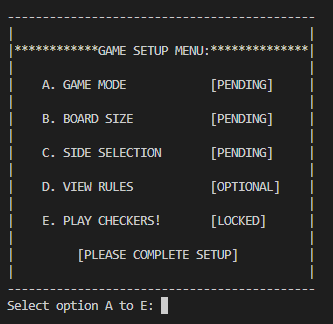
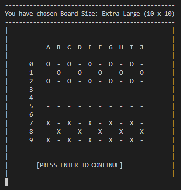

# Python Checkers (Work in progress)

Readme supporting Python Checkers application

# UX Planes
## Strategy
### - User Stories
## Scope
### - Wireframes
## Structure
## Skeleton
## Surface
Section addressing design process & User Experience Planes
# Features
## Existing Features:
### Welcome Screen:

### Main Menu:

### "Game Mode" Sub-menu:

### "Player vs. Computer" Game Mode Confirmation Screen:

### "Player vs. Player" Game Mode Confirmation Screen:

### "Board Selection" Sub-Menu:

### "Standard Board" Confirmation Screen:

### "Large Board" Confirmation Screen:

### "Extra Large Board" Confirmation Screen:

### "Team Selection" Sub-menu:

### "Noughts Team Selected" Confirmation Screen:

### "Crosses Team Selected" Confirmation Screen:

### "Rules" Screen:

### "Game Setup" Progress Tracking - Game Mode Updated:

### "Game Setup" Progress Tracking - Board Selection Updated:

### "Game Setup" Progress Tracking - Team Selection Updated:

### "Game Locked" Screen:

### "Game Ready" Screen:

## Features Left To Implement
Section describing features of the application
# Testing
## Generic Testing
## Python Testing
## Accessibility Testing
Detail testing carried out for application development
# Bugs
## Resolved Bugs
## Unresolved Bugs
Detail bugs encountered during development - succesfully debugged & yet to be resolved
# Deployment
## Github
## Heroku
Explain deployment processes - local & global
# Credits
## Content
## Code
## Media
List sources & resources used to develop the application 