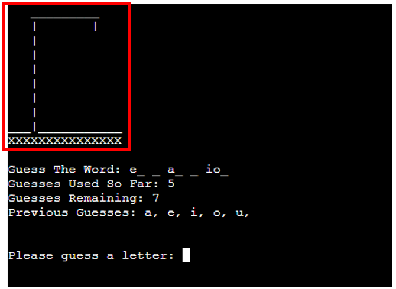

# Python Hangman (Work in progress)

Readme documentation for Hangman game created using Python, played in the terminal

# Features
## Existing Features:
### Welcome Screen:
The welcome screen greets the user upon loading the game and will load the actual game upon pressing the "Enter" Key

### Main Game Screen:
The Main Game screen is where the user will play the game of Hangman. It contains several sub-elements/features each of which are shown in more detail below:

### Gallows Feature:
The Gallows sits at the top of the main game screen, and acts as a visual representation of the player's quantity of incorrect guesses:

### Answer Tracker:
The Answer tracking section of the main game screen will display a placeholder area on which the player's guesses will be compared to the answer - each time the player guesses a letter correctly, one of the blank slots will be displaced by the correct letter, continuing until either the player has ran out of guesses, or until the player has correctly guessed all the letters in the word:

### Guess Counters:
There are two counting sections under the answer tracker, which will display to the user their progress in terms of how many guesses they have remaining, and how many guesses they have used in the game so far:

### Previous Guesses Recording:
This feature will record each previous guess a player has entered, and display the previous guesses as a list of comma separated letters below the guess-counter section. This will aid the user in terms of avoiding double-guessing a letter, and not having to try remember a long list of previous guesses:

### Guess entry prompt:
This is the key feature on the main game screen and is where the user will be prompted to enter their next guess at which letter may be contained in the answer:

### Notification Area - Correct Guess:
This is the key feature on the main game screen and is where the user will be prompted to enter their next guess at which letter may be contained in the answer:

### Notification Area - Incorrect Guess:
This is the key feature on the main game screen and is where the user will be prompted to enter their next guess at which letter may be contained in the answer:

### Notification Area - Non-Letter Warning:
This is the key feature on the main game screen and is where the user will be prompted to enter their next guess at which letter may be contained in the answer:

### Notification Area - Duplicate Guess Warning:
This is the key feature on the main game screen and is where the user will be prompted to enter their next guess at which letter may be contained in the answer:

### Game Won Notification:
This is the key feature on the main game screen and is where the user will be prompted to enter their next guess at which letter may be contained in the answer:

### Exit Game Prompt:
This is the key feature on the main game screen and is where the user will be prompted to enter their next guess at which letter may be contained in the answer:

## Features Left To Implement
Section describing features of the application

### Guess Word Functionality
### Add Phrases to Answer Pool 
### Difficulty Level Settings
### Guess limit extension/reduction

# UX Planes
## Strategy
### User Stories
As a user I would like to be able to:
- Play a game of Checkers against the computer or against another user
- Be able to play the game on boards of different sizes (standard, large and extra large)
- View the rules, objectives & history of the game of Checkers 
 
## Scope
### - Wireframes
## Structure
## Skeleton
## Surface

# Testing
## Generic Testing
## Python Testing
## Accessibility Testing
Detail testing carried out for application development
# Bugs
## Resolved Bugs
## Unresolved Bugs
Detail bugs encountered during development - succesfully debugged & yet to be resolved
# Deployment
## Github
## Heroku
Explain deployment processes - local & global
# Credits
## Content
## Code
## Media
List sources & resources used to develop the application 