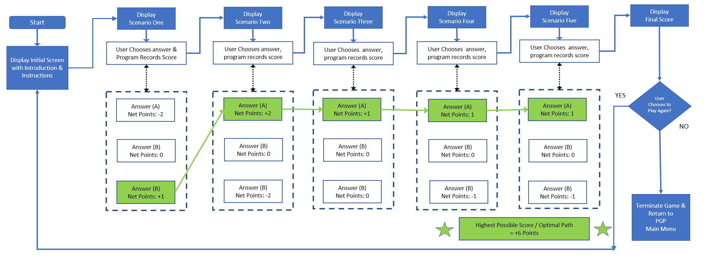
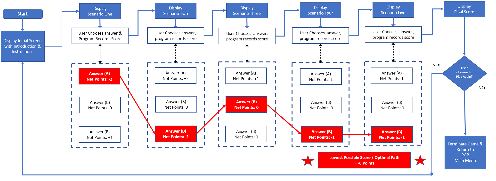
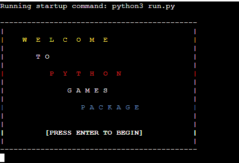

# Python Games Package 

This Readme documentation supports the application "Python Games Package" created using Python, and designed to be played in the terminal 

The application will allow the user the choice of playing either the word-guessing game "Hangman", or a text adventure-style game called "FictCorp Adventures" where the user must navigate a series of business decisions as the new CEO of a fictional corporation

# UX Planes

I have used the Five Planes of UX to design the application, and provide a description of the activities, connections, and flows through each of the UX Planes below:
## Strategy
The strategy for the application's User Experience was developed around addressing the User Needs and User Stories below - users will wish to:
- Have the ability to play either a game of Hangman or a text adventure game called "FictCorp Adventures" against the computer 
- See their progress through the games in terms of guesses used, guessed remaining and answer letters revealed for Hangman, and in terms of points scored and financial/stakeholder performance in FictCorp Adventures
- Have the option to either exit to the main menu or play again upon completion of an individual game
 
## Scope
The Scope of the application is informed by the Strategy above, in terms of the Functional Specifications and Requirements of the game - I wanted to ensure optimal scope to actualise the strategy by including content and interactivity that help enable the user stories.

The site's scope encompasses the provision of a fully functional hangman game to the user, with features that would appropriately deliver the user experience - including a drawable gallows, guess tracking/counting functionality, an answer display, and a suite of situational notifications to help guide the user through the game experience. 

Additionally the Text Adventure game "FictCorp Adventures" should ensure the provision to the user of a fully functional basic text adventure game, complete with multiple scenarios/questions, and multiple discretionary decision paths through each scenario - with each path having unique consequences and impacts both positive and negative upon the financial performance of the company, as well as sentiment amongst key stakeholders (shareholders, customers & employees)

I have also demarcated the original possible list of site scope into "existing features" and "features yet to implement" in the next section of this readme document - with the former containing the final features of the live site in the spirit of ensuring a Minimum Viable Product (MVP) that would meet project deadlines

## Structure

The application is delivered via a simple set of menus and screens which the user can easily & intuitively navigate with specific keystrokes when instructed. The first page containing the welcome message that greets the user upon initialising the game, and the second page housing the actual game choice menu & interface, which allows the user into playing either Hangman or FictCorp Adventures.

As detailed further in the "Features" section below, each game has it's own main game page. In the case of Hangman, this is a one-stop-shop delivering all of the user needs in one self-contained area - including everything from the gallows displaying the game progress, to guess counters, to answer tracking and a notification area. Whereas in the case of FictCorp Adventures, the game will progress through a series of five individual business decision scenarios, with cumulative score tracking and a final score report to close the game.

Based upon the site Strategy & Scope laid out above, I felt that this simple but effective structure would represent the optimal way of delivering the User Experience in a positive and effective manner

## Skeleton

To facilitate & guide the design of the application and User Experience, I created several flowcharts as wireframe diagrams using Microsoft Excel to map the flow control and activity sequencing throughout the stages of play for both games. 

### - Hangman Wireframe & Flowchart

The Flowchart below shows the macro-level flow of the Hangman application, with rectangular containers representing processing steps, and circular containers representing decision points where the program will take a different path depending on specific circumstances:

### - FictCorp Adventures - Overall Wireframe & Flowchart

The overall structure of the FictCorp Adventures text adventure style game is shown below - the game basically consists of five scenarios, each with three possible decision paths, which the user must navigate, with a set amount of points awarded for each decision path in each scenario. A running total of the user's score is displayed throughout, and presented at the conclusion of the game.

### - Optimal Decision Path wireframe

Below illustrates the "Best Case" decision path through the game - if the user selects each of the decision paths/options below, they will finish the game with the highest possible score & stakeholder sentiment.

### - Worst Case Decision Path wireframe

Below illustrates the "Worst Case" decision path through the game - if the user selects each of the decision paths/options below, they will finish the game with the lowest possible score & stakeholder sentiment.

## Surface
Finally, the evolution of the first four Planes of User Experience above allowed the Surface Plane to take shape in terms of arriving at the visual look & feel of the application to be experienced by the User

The Application is delivered via the Python terminal, which immediately sets several structural boundaries & constraints in terms of screen length (24 rows) and screen width (80 characters) 

Working within these boundaries I found that a simple series of border frames for the welcome screen, combined with appropriate line breaks & new lines on the main game screen would deliver the most visually pleasing surface Plane for the user's experience when playing. 

These Surface elements are discussed & illustrated in further detail in the "Features" section below

# Features
The main generic features of the overall application are discussed in detail below with screenshots and brief narrative descriptions:

### Welcome Screen:
The welcome screen greets the user upon loading the game and will load the game selection screen upon pressing the "Enter" Key

### Game Selection Screen:
The game selection screen allows the user to either choose a game to play, or to exit the application and will load the user's choice based upon pressing either key "A", "B", or "C" followed by the "Enter" Key

Due to the extended length of the features sections for the games sections of the application, I have broken the following sections of the Features content out into two separate markdown files with links contained in the table below. 

Please navigate to the linked locations below to view a more detailed walkthrough of the features, both existing and future, for both the Hangman & FictCorp Adventures components of the application:

Existing Features:  | Features Left To Implement: 
  ------------- | ------------ 
 [**Hangman**](https://github.com/dkelly255/python-games-package/blob/main/FEATURES-HANGMAN.md#existing-features---hangman) | [**Hangman**](https://github.com/dkelly255/python-games-package/blob/main/FEATURES-HANGMAN.md#future-features---hangman)
 [**FictCorp Adventures**](https://github.com/dkelly255/python-games-package/blob/main/FEATURES-FICTCORP.md#existing-features---fictcorp) | [**FictCorp Adventures**](https://github.com/dkelly255/python-games-package/blob/main/FEATURES-FICTCORP.md#future-features---fictcorp)

# Testing
In an effort to keep the readme documentation as streamlined & structured as possible, the testing approaches & results for the application are contained in a separate markdown file, stored in the [**testing**](https://github.com/dkelly255/python-games-package/blob/main/TESTING.md) location contained in the link [attached](https://github.com/dkelly255/python-games-package/blob/main/TESTING.md) 

Please navigate to this section for an in-depth analysis & overview of the code validation, code testing processes & procedures, and the testing results for all end-to-end aspects of the application & functionality.

# Bugs
The following section will provide detail & context in terms of the debugging exercises that were part of the development process.

## Resolved Bugs

**Hangman:**

- Notification Display Spacing - Originally some of the notification prompts were being punctuated by large blank spaces resulting in a bugged display to the user within the code institute terminal display. Upon investigation I found that this was triggered partly by my reflection of the Initial round of PEP8 code validation feedback whereby I had extended code onto new lines without the accompanying new line separator - this resolved the bug & closed the issue

- Incorrect Gallows build sequencing - Initially I found that the Gallows was building incorrectly for the user when they have logged an incorrect guess - following a debugging exercise I realised this was due to the gallows function being triggered by the number of guesses remaining, rather than by an incorrect guess & was able to resolve the bug.

- Erroneous Previous guess logging - In the early stages of development, I found that the "Previous Guess" log section of the main game screen would collect up all guesses entered by the user, whether the guesses were valid or not - for example strings of text longer than one character, or numbers and numbers were all logged as previous guesses rather than prohibited. I was able to resolve this following a debugging exercise and improve the data entry validation & controls along with associated warning/error notifications.

- Guess counters not incrementing properly with each new user guess - This bug was due to an incorrect parameter (guesses_remaining) being passed into my main_game_screen function and resulted in the "guesses used" counter remaining at zero after each user guess. Code Institute's tutor support helped me to resolve this issue by firstly pointing out that Python is a hybrid of a "Pass by Reference" and "Pass by value" language, and then also pointing out that the simple resolution to the bug was to ensure the correct parameter (guesses_used) was passed into the main_game_screen function.

**FictCorp Adventures:**
- Display Bugs - Throughout the game development I encountered several bugs impacting the readability of the game texts, prompts and dashboards. These were primarily driven by a combination of extended-length strings running over the 80-character Code Institute Terminal display width, as well as the reflection of the PEP8 Python validation guidelines for indentation & line length. Through extensive question-by-question and screen-by-screen debugging exercises I was able to resolve all of these bugs for the final release.

- Dashboard Display alignment bugs - Initially I found that the opening and closing Dashboard alignment would be negatively impacted depending on the size of the financial deltas resulting from the user's decision in each scenario. For example, if a decision caused a large in crease in revenue, the shareholder sentiment line would sometimes fall short or run over the line boundary leaving the possibility for a poorer User Experience. To resolve this, I created the "plug" functions, which would ensure the Stakeholder sentiment lines would always start & end at the same character, by measuring the length of the preceding financial metric display, and deducting it from a fixed line-width thus ensuring a cleaner display and resolving the display bug.

## Unresolved Bugs

- There were no other bugs of note left to report in the final version of the application deployed to Heroku (Details on the deployment are covered in the next section below)

# Deployment
The application was deployed via the "Heroku" service, and the link to the live deployment can be found by clicking [here](https://python-games-package.herokuapp.com/)

An extended list of detailed steps & instructions for deployment follows in the section below:

## - GitHub Deployment
Note - please ensure you have created a GitHub repository prior to proceeding to the "Heroku" deployment section below to ensure no rework or deployment issues
## - Heroku Deployment
The Steps for deployment to Heroku are as follows - Please note these steps are correct and current as at the time of application release)November 2021) but may be subject to change in future:
- Navigate to [Heroku](https://id.heroku.com/login) and create an account

- From the Heroku dashboard select the “Create new app” button.

- Choose a name for the application - I have chosen Python-Hangman but please note that the name must be unique.

- Select your region 

- Then click “Create app” - this will trigger a page with all the information for setting up the app.

Settings Tab:

- Config Vars - It is important to get your settings section done before you deploy  your code, the first section being the "config vars" - also known as "environment variables", are where sensitive data that needs to be kept private is stored. You must then create a Config Var called `PORT` which must be set to `8000`

- Buildpacks - The next step is to add buildpacks - These install further dependencies that we need. Click “Add buildpack”, add the Python buildpack first and then click “Save changes”. Then add the node.js Buildpack, to handle the mock terminal, again clicking “Save”. 
Note - please make sure the buildpacks are in this  order, with Python on top, and node.js underneath. If they're the other way around you  can click and drag them to change the order.

Deployment Tab: 

- Select Github here, and then we  can confirm that we want to connect to Github & search for the equivalent Github repository name, followed by “Search”. 

- Next, click “connect” to link up the Heroku app to our Github repository code, and scroll down to see two options - for manual or automatic deployment
- If you choose to enable automatic deployment then Heroku will rebuild the app every time you push a new change to your code in Github. 
- Alternatively you can choose to  manually deploy using the "deploy branch" option
- Finally, you will see the “App was successfully deployed” message  
and a button for the deployed link. 

## Local Deployment
Additionally - if you would like to make a local copy of the Github repository, you can clone it by typing the following command in your IDE terminal:

- `git clone https://github.com/dkelly255/python-games-package.git`

Alternatively, if you use Gitpod, you can click the button below to generate a new workspace using this repository.

# Credits
## Content:
As part of the generic research & development process to enable building the application, I benchmarked several different sources providing fully functional Hangman Python Terminal applications - these are listed below:

1. [How to build python Hangman in 10 minutes](https://www.youtube.com/watch?v=m4nEnsavl6w) - this tutorial from Youtube account "Kite" was a quick & comprehensive tutorial from which I gained several insights into the mechanics of a typical Python Terminal based game of Hangman

2. [How to Code a Game of Hangman (Beginner Python Tutorial)](https://www.youtube.com/watch?v=cJJTnI22IF8) - this is a similar tutorial from Youtube account "Kylie Ying", detailing how to successfully program a simple game of Hangman using Python

3. [Terminal Hangman in Python](https://github.com/Pran54/Hangman) - This repository from Github was returned from a search engine research exercise and contained similar insights into the detailed mechanics of how to program a simple game of Hangman using the Python Terminal

## Code:

Within the application I have used the following sections of code at varying stages to help deliver the final release, each source is detailed and attributed both below and in the code comments from a credits perspective:

- [Clear Terminal function:](https://www.geeksforgeeks.org/clear-screen-python/) I required a function to clear the terminal for use in multiple stages of the application - in both Hangman and FictCorp Adventures games. After researching several sources via Search Engines I found the following method used by [GeeksForGeeks.org](https://www.geeksforgeeks.org/clear-screen-python/) which involved the importation of the name and system functions from the OS library

- I sourced the method for [Printing colored text](https://stackoverflow.com/questions/287871/how-to-print-colored-text-to-the-terminal) to the terminal from the Stack Overflow Article linked [here](https://stackoverflow.com/questions/287871/how-to-print-colored-text-to-the-terminal), and this functionality was used to add color to both the welcome screen, and to the two key "guesses remaining" warnings that occur towards the conclusion of the Hangman game, both of which are intended to add to building a positive UX for the User.

- [Typewriter Effect Function:](https://www.codegrepper.com/code-examples/python/typewriter+effect+python+terminal) Given the text-intensive nature of the FictCorp Adventures game, I wanted to ensure the user was not overwhelmed by large blocks of text appearing simultaneously, and felt that the text appearing in small sections, and gradually would help the user visually parse the information in a more efficient manner. This typewriter function from [Codegrepper.com](https://www.codegrepper.com/code-examples/python/typewriter+effect+python+terminal) helped with this objective, and has been fully attributed & credited.

- The [Sleep](https://www.programiz.com/python-programming/time/sleep) function is used at several points throughout the application to help improve the UX by giving the user time to parse & process text visually, generally warning/notification messages, and particularly in the Hangman section of the application. I was able to find this [article](https://www.programiz.com/python-programming/time/sleep) from [programiz.com](https://www.programiz.com/python-programming/time/sleep) on how to use the sleep function, including importation from the appropriate Python library.

- The [Word List](https://github.com/Xethron/Hangman/blob/master/words.txt) used for the Hangman game was sourced from a search engine researching exercise - the GitHub Repo linked above from user [Xethron](https://github.com/Xethron/Hangman/blob/master/words.txt) contains a large list of words which was suitable for the purposes of my application. Note I applied some processing steps to the raw data, including stripping out any blank lines, and removing any words of length less than three, as I felt these words would not add to the User Experience were they to be part of the final release.

- The code for [Removing Words Under A Certain Length](https://stackoverflow.com/questions/10150725/beginner-issue-python-how-do-i-remove-words-from-a-list-under-a-certain-leng) from the opening Word Bank was also sourced from [Stack Overflow](https://stackoverflow.com/questions/10150725/beginner-issue-python-how-do-i-remove-words-from-a-list-under-a-certain-leng) with the details being contained in the link above and being fully attributed & credited in the code comments as well as the readme credits section.

- I sourced the code for [Importing words from a .txt file](https://stackoverflow.com/questions/30768056/importing-external-txt-file-in-python) from the linked [Stack Overflow](https://stackoverflow.com/questions/30768056/importing-external-txt-file-in-python) article - this was very brief, concise & accurate code which helped tie together the mechanics of the game towards the end of development when I was switching from a very small development words bank for testing purposes to a larger operational word bank for the final release.

- The [Emoji Icons For FictCorp Dashboard](https://emojipedia.org/) were all sourced from the [emojipedia.org](https://emojipedia.org/) site linked above and are heavily used at various stages throughout the dashboard displays to add a visual element to the User Experience in the Code Institute Terminal

## Technologies & Libraries Used:
To deliver the final application functionality, I made use of several of the Built-In Python Libraries - these are detailed below:

- OS Library: From the Python OS library I imported the "system" and "name" functions to enable the "clear the terminal" function used at regular intervals throughout the game sequence

- Random Library: The "Random" Python library provided one of the cornerstone functions within the application - the "choice" function which is used to pull a random word from the total array of words in the answer bank - allowing for a better user experience & an element of unpredictability when playing the game.

- Time Library: The "Sleep" function is used at varying stages throughout the application to provide delays to allow the user process & parse information at different key stages of game execution - particularly during the Hangman game.

- The [Code Institute Python Essentials Template](https://github.com/Code-Institute-Org/python-essentials-template) Repository was used as a baseline for the project along with the Code Institute Mock Terminal application to allow the application to run on a simulated terminal in a web page
