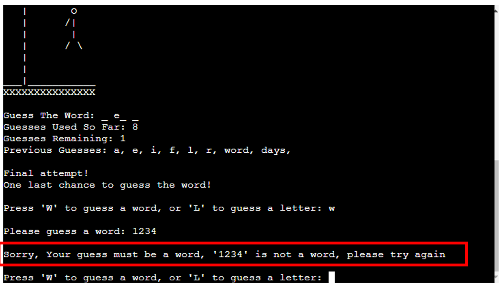

# Python Games Package 

This Readme documentation supports the application "Python Games Package" created using Python, and designed to be played in the terminal 

The application will allow the user the choice of playing either the word-guessing game "Hangman", or a text adventure-style game called "FictCorp Adventures" where the user must navigate a series of business decisions as the new CEO of a fictional corporation

# UX Planes

I have used the Five Planes of UX to design the application, and provide a description of the acitvities, connections, and flows through each of the UX Planes below:
## Strategy
The strategy for the application's User Experience was developed around addressing the User Needs and User Stories below - users will wish to:
- Have the ability to play a game of Hangman against the computer 
- See their progress through the game in terms of guesses used, guessed remaining and answer letters revealed
- Have the option to either exit the game or play again upon completion of an individual game
 
## Scope
The Scope of the application is informed by the Strategy above, in terms of the Functional Specifications and Requirements of the game - I wanted to ensure optimal scope to actualise the strategy by including content and interactivity that help enable the user stories.

The site's scope encompasses the provision of a fully functional hangman game to the user, with features that would appropriately deliver the user experience - including a drawable gallows, guess tracking/counting functionality, an answer display, and a suite of situational notifications to help guide the user through the game experience

I have also demarcated the original possible list of site scope into "existing features" and "features yet to implement" in the next section of this readme document - with the former containing the final features of the live site in the spirit of ensuring a Minimum Viable Product (MVP) that would meet project deadlines

## Structure

The application is delivered via a simple 2-page structure, with the first page containing the welcome message that greets the user upon initialising the game, and the second page housing the actual game content & interface.

As detailed further in the "Features" section below, the main game page is a one-stop-shop delivering all of the user needs in one self-contained area - including everything from the gallows displaying the game progress, to guess counters, to answer tracking and a notification area.

Based upon the site Strategy & Scope laid out above, I felt that this simple but effective structure would represent the optimal way of delivering the User Experience in a positive and effective manner

## Skeleton

To facilitate & guide the design of the application and User Experience, I created a flowchart using Microsoft Excel to map the game's flow control and activity sequencing throughout the stages of play. 

The Flowchart below shows the macro-level flow of the application logic & flow, with rectangular containers representing processing steps, and circular containers representing decision points where the program will take a different path depending on specific circumstances:
### - Hangman Wireframe & Flowchart

### - Fictcorp Adventures - Overall Wireframe & Flowchart

### - Optimal Decision Path wireframe

### - Worst Case Decision Path wireframe

## Surface
Finally, the evolution of the first four Planes of User Experience above allowed the Surface Plane to take shape in terms of arriving at the visual look & feel of the application to be expereienced by the User

The Application is delivered via the Python terminal, which immediately sets several structural boundaries & constraints in terms of screen length (24 rows) and screen width (80 characters) 

Working within these boundaries I found that a simple series of border frames for the welcome screen, combined with appropriate line breaks & new lines on the main game screen would deliver the most visually pleasing surface Plane for the user's experience when playing. 

These Surface elements are discussed & illustrated in further detail in the "Features" section below

# Features
The main features of the application are discussed in detail below - I have segregated the features into two sections - "Existing Features" and "Features Left To Implement" with screenshots and narrative descriptions where appropriate:
## Existing Features:

### Word Bank:
The libraray of words for the game is contained in the file "words.txt", and is imported into the main run.py Python file. I found this approach enabled the best user experience in that it gave a very large selection of words of varying lengths and difficulties to keep the game interesting for the User/s. The source is attributed & detailed in the credits section.

### Welcome Screen:
The welcome screen greets the user upon loading the game and will load the game selection screen upon pressing the "Enter" Key

### Game Selection Screen:
The game selection screen allows the user to either choose a game to play, or to exit the applciation and will load the user's choice based upon pressing either key "A", "B", or "C" followed by the "Enter" Key

# Hangman - Existing Features:
The following section details the features specific to the "Hangman" component of the application:

### Hangman Welcome Screen:
This is the initial introductory screen greeting the user upon selection of the Hangman game from the game selection menu

### Main Game Screen:
The Main Game screen is where the user will play the game of Hangman. It contains several sub-elements/features each of which are shown in more detail below:

### Gallows Feature:
The Gallows sits at the top of the main game screen, and acts as a visual representation of the player's quantity of incorrect guesses:

### Answer Tracker:
The Answer tracking section of the main game screen will display a placeholder area on which the player's guesses will be compared to the answer - each time the player guesses a letter correctly, one of the blank slots will be displaced by the correct letter, continuing until either the player has ran out of guesses, or until the player has correctly guessed all the letters in the word:

### Guess Counters:
There are two counting sections under the answer tracker, which will display to the user their progress in terms of how many guesses they have remaining, and how many guesses they have used in the game so far:

### Previous Guesses Recording:
This feature will record each previous guess a player has entered, and display the previous guesses as a list of comma separated letters below the guess-counter section. This will aid the user in terms of avoiding double-guessing a letter, and not having to try remember a long list of previous guesses:

### Guess entry prompt:
This is the key feature on the main game screen and is where the user will be prompted to enter their next guess at which letter may be contained in the answer:

### Warning notification - guess count at three or less:
When the user reaches the point of having only three guesses remaining, this feature will activate, informing the user of their limited remaining guesses, and adding to the overall UX:

### Guess Word or Letter functionality:
The reduction of the guesses remaining count down to three or less will also trigger the activiation of a feature allowing the user to guess either the full word or a single letter, further adding to the UX:

### Warning notification - final guess remaining:
When the user reaches the point of having only one guess remaining, this feature will activate, informing the user of their limited final chance to guess the answer, and adding to the overall UX:

### Notification - Correct Guess:
The notification feature for correctly guessing a letter is shown below:

### Notification - Incorrect Guess:
The equivalent notification for when an incorrect letter has been guessed is shown below:

### Data-Validation - Non-Letter Warning:
The example below shows the warning feature displayed when a user has entered a guess that is not a letter:

### Data Validation - Duplicate Letter Guess Warning:
A similar warning will be displayed if the user enters a letter that they have already guessed - this will trigger a duplicate entry warning to aid the user:

### Data validation - Incorrect guess length warning (Letter)
This data validation feature warns the user when they have entered a guess that does not meet the letter length requiremenet (i.e. a single character), as part of the defensive design approach and dealing elegantly with incorrect data entry

### Data validation - Incorrect guess length warning (Word)
Similarly, this data validation feature warns the user when they have entered a guess that does not meet the word length requiremenet (i.e. the guess must be the same length as the answer).

The warning will fire when the guess is either too long, or too short, as demonstrated in the screenshots below:

### Data Validation - Non-Alpha word
This feature will ensure a warning message is displayed to the user in the event of trying to guess a word that contains non-alphabetic characters:

### Data Validation - Duplicate Guess word
This feature will ensure a warning message is displayed to the user in the event of trying to guess a word that has already been guessed:

### Game Won Notification:
The final type of notification to be displayed is the game conclusion - in the example below - the user has won, and the notification area will display a message confirmation:

### Game Lost Notification:
In the event that the player loses the game, the message below will be displayed informing the user of the game conclusion:

### Exit Game Prompt:
Upon conclusion of the game, this feature will provide the user with two options - they can either exit the application by pressing the "e" or "E" key, or they can choose to play another game by pressing any other key followed by the "Enter" key:

# FictCorp Adventures - Existing Features:
The following section details the features specific to the "FictCorp Adventures" component of the application:

## Welcome Screen
The Welcome screen greets the user upon the initial load of the game and shows the game title along with some of the emojis used later to illustrate the different stakeholder sentiment levels - the user continues past this screen by pressing "enter"

## Game Rules / Instructions & Introductory Story Screen
The user is given an overview of the game rules & instructions via this feature, with the Typewriter effect being used to display the text on serving the purpose of both adding to the UX by giving the introduction a more cinematic feel, and also helps the user to visually parse the information by displaying it gradually/piecemeal rather than overwhelm the user with one large block of text:

## Performance Dashboard
An integral feature of the game is the performance dashboard. This feature is used to display to the user their progress, both in terms of the financial snapshot of the company's revenue, costs, and profits, as well as the key stakeholders and their current sentiment, represented via emojis on a scale of -2 to +2, with 0 being neutral

### Financial Projections
This section of the dashboard feature will display the projected financial data for the company's year ahead - revenue, costs and profits, as well as any impact the user's decisions have upon these projections

### Stakeholder Sentiment
This section of the dashboard feature will display a snapshot of the sentiment of the company's key stakeholders - shareholders, employees and customers - with an emoji for each to give a visual representation of the stakeholder's satisfaction level. The impact of the user's decisions will cause changes in the stakeholder's sentiment levels, and the user will recieve points for positive changes and will lose points for negative changes

## Cumulative Score Tracking
This feature will track the user's score as they move through each question. Any points the user gains/loses from their proposed courses of action will be cumulatively tracked and displayed here.

## Scenario 1
This is the first scenario the user must navigate, and involves making a decision on the selling price for the company's leading product. You can see from the dashboard snapshot that all metrics both financial and stakeholder-related are at their default values. The user must choose between option A, B or C and will then be shown the impact of their decision on both the company financials, and stakeholder sentiment.

The section below details the possible decision paths the user can take through scenario one:

If the user selects answer A for example, it will have an overall negative effect on the company's financial status & stakeholder sentiment. Customers will be dissatisfied with the increased prices they have to pay, and will look elsewhere for alternatives, cauing a net decrease in revenues. This will knock on into reduced profits, which will also cause shareholder sentiment to decline. 

Answer B will have no material effect on current financials or stakeholder sentiment, and will award/deduct zero points as a result.

Whereas Answer C will lead to an award of a single point to the user as a result of managing to improve revenues (increasing shareholder status) without losing any employee or customer sentiment

### Answer A

### Answer B

### Answer C

In all cases, the user's closing points score from scenario one will carry forward to the next scenario for the user and will be reflected in their opening dashboard for scenario two - detailed in the next section below:

## Scenario 2
This is the second scenario the user must navigate, and involves making a decision on the marketing budget for the year ahead. The opening dashboard snapshot will show the snapshot carried forward from scenario one for all metrics across financial and stakeholder sentiment (In this case the user has selected option A for Scenario one, leading to an opening score of -2) 

The user must again choose between option A, B or C before being shown the impact of their decision on the closing dashboard display to be carried forward to scenario 3

In terms of the possible decision paths through scenario two - If the user selects answer A, it will have an overall positive effect on the company's financial status & stakeholder sentiment. Customer satisfaction will be increased with the additional marketing efforts causing the customer base to expand, driving a net increase to profits after accounting for the increased marketing costs, leading to an increase in shareholder sentiment level. Overall this will give the user a score of +2 points

Answer B will again have no material effect on current financials or stakeholder sentiment, with no change to current plans, and will award/deduct zero points as a result.

Whereas Answer C will lead to a deduction of two points (shareholders and customers) due to decreased units sold reducing revenues which is a negative for shareholders, and also a negative for customers, as they decide to take their business elsewhere in light of the reduced marketing expenditure relative to competitors

### Answer A

### Answer B

### Answer C

As usual - per the game mechanics, in all cases, the user's closing points score from scenario two will carry forward to the next scenario for the user and will be reflected in their opening dashboard for scenario three - detailed in the next section below:

## Scenario 3
In this scenario the user must decide on a rate to negotiate for material supply prices. The opening dashboard snapshot will show the snapshot carried forward from scenario two for all metrics across financial and stakeholder sentiment. However, please note that for the purposes of the readme not all of the opening dashboards will be linearly sequenced in order to illustrate each of the possible decision paths through each question - here for example the user is starting from a score of zero - which reflects having chosen option B for both scenario one and two. 

As always, the user must again choose between option A, B or C before being shown the impact of their decision on the closing dashboard display to be carried forward to scenario 4

In terms of the possible decision paths through scenario three - If the user selects answer A, it will have an overall positive effect on the company's financial status & stakeholder sentiment. Employees in this case are happy that they are now working with a higher quality of material, and customers are also happy that the build quality of their product has improved. However there is no positive score in this case for shareholders due to the lack of progress in terms of revenues, costs or profits. Overall this will give the user a score of +2 points

Answer B will again have no material effect on current financials or stakeholder sentiment, with no change to current plans, and will award/deduct zero points as a result.

Similarly, Answer C will also lead to a net zero points score due to customer dissatisfaction with the new low cost, but low quality materials, offsetting the positive sentiment generated amongst shareholders from the increased profit driven by the reduced costs of manufacture.

### Answer A

### Answer B

### Answer C

As usual - per the game mechanics, in all cases, the user's closing points score from scenario three will carry forward to the next scenario for the user and will be reflected in their opening dashboard for scenario four - detailed in the next section below:

## Scenario 4
In this scenario the user must decide on setting the coming year's employee payroll budget, and as standard, the user must choose between option A, B or C before being shown the impact of their decision on the closing dashboard display to be carried forward to the final scenario:

In terms of the possible decision paths through this scenario - If the user selects answer A, it will have an overall net zero effect on the company's financial status & stakeholder sentiment. Employees in this case are happy that they have increased salaries, but shareholders are causing a points deduction due to the negative impacts on costs dialling through to reduced profits. 

Answer B will again have no material effect on current financials or stakeholder sentiment, with no change to current plans, and will award/deduct zero points as a result.

Similarly, Answer C will also lead to a net zero points score due to employee dissatisfaction with the new lower payroll budget, offsetting the positive sentiment generated amongst shareholders from the increased profit driven by the reduced costs of goods sold.

### Answer A

### Answer B

### Answer C

As usual - per the game mechanics, in all cases, the user's closing points score from scenario four will carry forward to the next scenario for the user and will be reflected in their opening dashboard in the final scenario - detailed in the next section below:

## Question 5

In this final scenario the user must decide on setting a budget for the upcoming "Workplace Improvement Strategy" and as standard, the user must choose between option A, B or C before being shown the impact of their decision on the closing dashboard display:

In terms of the possible decision paths through this scenario - If the user selects answer A, it will have an overall net zero effect on the company's financial status & stakeholder sentiment. Employees in this case are happy that they have an improved workplace environment, but shareholders are causing a points deduction due to the negative impacts on costs dialling through to reduced profits. 

Answer B will again have no material effect on current financials or stakeholder sentiment, with no change to current plans, and will award/deduct zero points as a result.

Similarly, Answer C will also lead to a net zero points score due to employee dissatisfaction with the reduced investment in the workplace, offsetting the positive sentiment generated amongst shareholders from the increased profit driven by the reduced costs of goods sold.

### Answer A

### Answer B

### Answer C

With this being the final scenario, there is no carry-forward to another dashboard, with the user instead being presented with their cumulative total score, and the option to either play again to try to improve this score by investigating the impact of alternate decision paths through the game, or if they wish to exit the game, they can now do so.

Both of these final features are detailed below:

## Final Score Display

Here you can see the feature displaying to the user their final cumulative score resulting from the decision path they have chosen through the game, displayed together with a notificaiton to confirm to the user that they have completed all of the required scenarios and decisions:

## Exit Game/Play Again Menu

Finally - this feature will display upon conclusion of the game, and will give the user the option of either trying to beat their previous score by navigating a different decision path through the game, or alternatively they can now exit the game if they wish, by pressing "E" followed by enter, which will return them to the Python Games Package main menu.

## Features Left To Implement - Hangman
There were several additional features which could be added to the Hangman application - each of which are detailed below:

### Guess Word Functionality
This would add a feature to the game whereby the user would have the option to "guess the word" at any point in the game, rather than continuing to guess individual letters. It would save the user time, and would add an element of risk to the game if accompanied by an "automatic fail" if the user guesses the wrong word, triggering the game lost screen.

### Add Phrases to Answer Pool 
An additional feature that could be added in future is for the user to have the option to "guess a phrase" instead of the deafult option of "guessing a word". It would add an extra dimension to the game and would contribute to a positive User Experience

### Difficulty Level Settings
Difficulty level setting could also be additional features in future - giving the user the ability to specifiy a difficulty level, which would be primarily be determined by the length of the word being guessed. For example - easier words would be of shorter length, with harder diffuclty words being longer in length.

### Guess limit extension/reduction
The ability for the user to modify their guess limits would also be a potential future feature for the game - adding depth to the game by allowing higher and lower guess limits according to the user's personal choice.

## Features Left To Implement - Fictcorp Adventures

### Extended Question Bank
In an unconstrained environment, I would like to add many additional questions and scenarios to the existing five scenarios which would add more color & depth to the User Experience investigating many different areas of the business and stakeholder sentiment. However, with project deadlines I have decided to leave an extended question bank out of scope for this release in the spirit of having a Minimum Viable Product (MVP) for project deadlines.

### Random question Selection
In conjunction with the extended question bank above, it would be a potential additional feature for future releases of the game to add in a random selector for each question adding an element of variety and chance to the game to help with the User Experience. This would mean each time the User loads the game, they will not know which questions/scenarios will appear, and which sequence the questions will appear in.

### Game length Control
This would also be a possible feature whereby the user can select a quick game (3x scenarios), a standard game (5x scenarios) or an extended game (7x scenarios) depending on their wishes and time availability. This would work in combination with the extended question bank, and random question generation features above.

# Testing
The testing approaches & results for the application are fully detailed in the TESTING.md file attached - please navigate to this section for details of the application's testing.

# Bugs
The following section will provide detail & context in terms of the debugging exercises that were part of the development process.

## Resolved Bugs

**Hangman:**

- Notification Display Spacing - Originally some of the notification prompts were being punctuated by large blank spaces resulting in a bugged display to the user within the code institute terminal display. Upon investigation I found that this was triggered partly by my reflection of the Initial round of PEP8 code validation feedback whereby I had extended code onto new lines without the accompanying new line separator - this resolved the bug & closed the issue

- Incorrect Gallows build sequencing - Initially I found that the Gallows was building incorrectly for the user when they have logged an incorrect guess - following a debugging exercise I realised this was due to the gallows function being triggered by the number of guesses remaining, rather than by an incorrect guess & was able to resolve the bug.

- Erroneous Previous guess logging - In the early stages of development, I found that the "Previous Guess" log section of the main game screen would collect up all guesses entered by the user, whether the guesses were valid or not - for example strings of text longer than one character, or numbers and numbers were all logged as previous guesses rather than prohibited. I was able to resolve this following a debugging exercise and improve the data entry validation & controls along with associated warning/error notifications.

- Guess counters not incrementing properly with each new user guess - This bug was due to an incorrect parameter (guesses_remaining) being passed into my main_game_screen function and resulted in the "guesses used" counter remaining at zero after each user guess. Code Institute's tutor support helped me to resolve this issue by firstly pointing out that Python is a hybrid of a "Pass by Reference" and "Pass by value" language, and then also pointing out that the simple resolution to the bug was to ensure the correct parameter (guesses_used) was passed into the main_game_screen function.

**FictCorp Adventures:**
- Display Bugs - Throughout the game development I encountered several bugs impacting the readability of the game texts, prompts and dashboards. These were primarily driven by a combination of extended-length strings running over the 80-character Code Institute Terminal display width, as well as the reflection of the PEP8 Python validation guidelines for indentation & line length. Through extensive question-by-question and screen-by-screen debugging exercises I was able to resolve all of these bugs for the final release.

- Dashboard Display alignment bugs - Intially I found that the opening and closing Dashboard alignment would be negatively impacted depending on the size of the financial deltas resulting from the user's decision in each scenario. For example, if a decision caused a large in crease in revenue, the shareholder sentiment line would sometimes fall short or run over the line boundary leaving the possibility for a poorer User Experience. To resolve this, I created the "plug" functions, which would ensure the Stakeholder sentiment lines would always start & end at the same character, by measuring the length of the preceeding financial metric display, and deducting it from a fixed line-width thus ensuring a cleaner display and resolving the bdisplay bug.

## Unresolved Bugs
- One current bug that still exists at the time of REadme preparation is the persistance of the two lines of invalid strings at the top of the CI Terminal display on each screen of teh FictCorp adventures game. These lines are not driven by my code, and are not present when I run the game in the gitpod terminal and are currently under investigation for resolution.

- There were no other bugs of note left to report in the final version of the application deployed to Heroku (Details on the deployment are covered in the next section below)

# Deployment
The application was deployed via the "Heroku" service, and the link to the live deployment can be found by clicking [here](https://python-checkers.herokuapp.com/)

An extended list of detailed steps & instructions for deployment follows in the section below:

## Github
Note - please ensure you have created a github repository prior to proceeding to the "Heroku" deployment section below to ensure no rework or deployment issues
## Heroku
The Steps for deployment to Heroku are as follows:
- Navigate to [Heroku](https://id.heroku.com/login) and create an account

- From the Heroku dashboard select the “Create new app” button.

- Choose a name for the application - I have chosen Python-Hangman but please note that the name must be unique.

- Select your region 

- Then click “Create app” - this will trigger a page with all the information for setting up the app.

Settings Tab:

- Config Vars - It is important to get your settings section done before you deploy  your code, the first section being the "config vars" - also known as "environment variables", are where sensitive data that needs to be kept private is stored. You must then create a Config Var called `PORT` which must be set to `8000`

- Buildpacks - The next step is to add buildpacks - These install further dependencies that we need. Click “Add buildpack”, add the Python buildpack first and then click “Save changes”. Then add the node.js Buildpack, to handle the mock terminal, again clicking “Save”. 
Note - please make sure the buildpacks are in this  order, with Python on top, and node.js underneath. If they're the other way around you  can click and drag them to change the order.

Deployment Tab: 

- Select Github here, and then we  can confirm that we want to connect to Github & search for the equivalent Github repository name, followed by “Search”. 

- Next, click “connect” to link up the Heroku app to our Github repository code, and scroll down to see two options - for manual or automatic deployment
- If you choose to enable automatic deployment then Heroku will rebuild the app every time you push a new change to your code in Github. 
- Alternatively you can choose to  manually deploy using the "deploy branch" option
- Finally, you will see the “App was successfully deployed” message  
and a button for the deployed link. 

## Local Deployment
Additionally - if you would like to make a local copy of the Github repository, you can clone it by typing the following command in your IDE terminal:

- `git clone https://github.com/dkelly255/python-checkers.git`

Alternatively, if you use Gitpod, you can click the button below to generate a new workspace using this repository.

# Credits
## Content
As part of the generic research & development process to enable building the application, I benchmarked several different sources providing fully functional Hangman Python Terminal applications - these are listed below:

1. [How to build python Hangman in 10 minutes](https://www.youtube.com/watch?v=m4nEnsavl6w) - this tutorial from Youtube account "Kite" was a quick & comprehensive tutorial from which I gained several insights into the mechanics of a typical Python Terminal based game of Hangman

2. [How to Code a Game of Hangman (Beginner Python Tutorial)](https://www.youtube.com/watch?v=cJJTnI22IF8) - this is a similar tutorial from Youtube account "Kylie Ying", detailing how to successfully program a simple game of Hangman using Python

3. [Terminal Hangman in Python](https://github.com/Pran54/Hangman) - This repository from Github was returned from a search engine research exercise and contained similar insights into the detailed mechanics of how to program a simple game of Hangman using the Python Terminal

## Code
- [Clear Terminal function:](https://www.geeksforgeeks.org/clear-screen-python/) I required a function to clear the terminal for use in multiple stages of the application - after researching several sources I found the following method used by [GeeksForGeeks.org](https://www.geeksforgeeks.org/clear-screen-python/) whic involved the importation of the name and system functions from the OS library

## Technologies & Libraries Used
To deliver the final application functionality, I made use of several of the Built-In Python Libraries - these are detailed below:

- OS Library: From the Python OS library I imported the "system" and "name" functions to enable the "clear the terminal" function used at regular intervals throughout the game sequence

- Random Library: The "Random" Python library provided one of the cornerstone functions within the application - the "choice" function which is used to pull a random word from the total array of words in the answer bank - allowing for a better user expereience & an element of unpredictability when playing the game.

- The [Code Institute Python Essentials Template](https://github.com/Code-Institute-Org/python-essentials-template) Repository was used as a baseline for the project along with the Code Institute Mock Terminal application to allow the application to run on a simulated terminal in a web page
