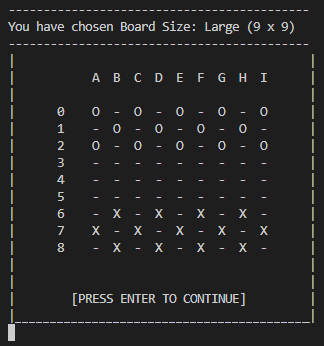

# Python Checkers (Work in progress)

Readme documentation for Checkers game created using Python, played in the terminal

# Features
## Existing Features:
### Welcome Screen:
The welcome screen greets the user upon loading the game and will lead to the Main Menu upon pressing the "Enter" Key

### Main Menu:
The Main Menu is the central hub-screen of the game, and allows the user to setup the required options before playing. It contains five options, labelled A through E, each of which are detailed further below.

The menu screen will also display to the user how many of the requirements they have completed, and whether they have unlocked the ability to play the game.

### "Game Mode" Sub-menu:
The first required setup activity - the "Game Mode" sub menu - is triggered by selecting option A from the Main Menu above. It will take the user to a screen where they can choose whether they wish to play against the computer, or against another player. 

The application will return the user to the Main Menu after completing this setup activity.

### "Player vs. Computer" Game Mode Confirmation Screen:
This confirmation screen will be displayed to the user to confirm their choice of the "Player vs. Computer" Game Mode. It is triggered by selecting option A from the Game Mode Sub-Menu above.

The application will return the user to the Main Menu after completing this setup activity.

### "Player vs. Player" Game Mode Confirmation Screen:
This confirmation screen will be displayed to the user to confirm their choice of the "Player vs. Player" Game Mode. It is triggered by selecting option B from the Game Mode Sub-Menu above.

The application will return the user to the Main Menu after completing this setup activity.

### "Board Selection" Sub-Menu:
The second required setup activity - the "Baord Selection" sub menu - is triggered by selecting option B from the Main Menu above. It will take the user to a screen where they can choose whether they wish to play on a board of size standard, large or extra-large. 

The application will return the user to the Main Menu after completing this setup activity.

### "Standard Board" Confirmation Screen:
This confirmation screen will be displayed to the user to confirm their choice of the "Standard" size Game Board. It is triggered by selecting option A from the Board Selection Sub-Menu above.

The application will return the user to the Main Menu after completing this setup activity.

### "Large Board" Confirmation Screen:
This confirmation screen will be displayed to the user to confirm their choice of the "Large" size Game Board. It is triggered by selecting option B from the Board Selection Sub-Menu above.

The application will return the user to the Main Menu after completing this setup activity.

### "Extra Large Board" Confirmation Screen:
This confirmation screen will be displayed to the user to confirm their choice of the "Extra-Large" size Game Board. It is triggered by selecting option C from the Board Selection Sub-Menu above.

The application will return the user to the Main Menu after completing this setup activity.

### "Team Selection" Sub-menu:
The third and final required setup activity - the "Team Selection" sub menu - is triggered by selecting option C from the Main Menu above. It will take the user to a screen where they can choose whether they wish to play as Team Noughts, or Team Crosses. 

The application will return the user to the Main Menu after completing this setup activity.

### "Noughts Team Selected" Confirmation Screen:
This confirmation screen will be displayed to the user to confirm their choice of the "Noughts" team. It is triggered by selecting option A from the Team Selection Sub-Menu above.

The application will return the user to the Main Menu after completing this setup activity.

### "Crosses Team Selected" Confirmation Screen:
This confirmation screen will be displayed to the user to confirm their choice of the "Crosses" team. It is triggered by selecting option B from the Team Selection Sub-Menu above.

The application will return the user to the Main Menu after completing this setup activity.

### "Rules" Screen:
This screen is view-only and is optional, i.e. not required in orer to unlock the ability to play the game. The screen displays a simple summary of the game rules and objectives to the user, and will return the user to the main menu after completing

### "Game Locked" Screen:
As a control feature, If the user selects option E from the Main Menu above before completing the required steps, the application will prevent the user from playing the game until all required setup inputs have been provided. 

If the user tries to start the game before these pre-requisities have been completed, they will be greeted by the "Game Locked" screen below, which will request the user to complete the required setup activites, and will return them to the main menu to complete the game setup.

### "Game Setup" Progress Tracking - Game Mode Updated:
To aid the user with completing these required setup activities - An additional feature of the Main Menu is the setup-progress-tracking for each element of the setup. 

Below you can see an example of the "Game Mode" progress tracking - where the status has updated from "PENDING" to reflect the user's particular choice of game-mode.

### "Game Setup" Progress Tracking - Board Selection Updated:
The "Board Selection" element of the Main Menu's progress tracking feature is detailed below - where the status has updated from "PENDING" to reflect the user's particular choice of board selection.

### "Game Setup" Progress Tracking - Team Selection Updated:
And finally - The "Team Selection" element of the Main Menu's progress tracking feature is detailed below - where the status has updated from "PENDING" to reflect the user's particular choice of Team.

### "Game Ready" Screen:
When the user has successfully completed all required setup activities, and has selected option E from the Main Menu to play the game, they will be greeted with the "Game Ready" confirmation screen below - leading them into the game they have setup.

## Features Left To Implement
Section describing features of the application

# UX Planes
## Strategy
### User Stories
As a user I would like to be able to:
- Play a game of Checkers against the computer or against another user
- Be able to play the game on boards of different sizes (standard, large and extra large)
- View the rules, objectives & history of the game of Checkers 
 
## Scope
### - Wireframes
## Structure
## Skeleton
## Surface

# Testing
## Generic Testing
## Python Testing
## Accessibility Testing
Detail testing carried out for application development
# Bugs
## Resolved Bugs
## Unresolved Bugs
Detail bugs encountered during development - succesfully debugged & yet to be resolved
# Deployment
## Github
## Heroku
Explain deployment processes - local & global
# Credits
## Content
## Code
## Media
List sources & resources used to develop the application 