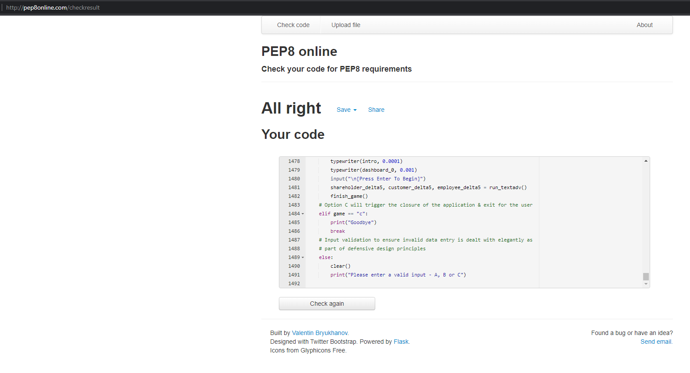

# Testing

## **Generic Testing - PEP8 Validation**
I have used the PEP8 Python code validation service to test the entire program code and resolved all errors & addressed all recommendations. The confirmation output has passed without any errors, notifications or warnings as shown in screenshot below:

## **Specific Testing - Hangman**

Welcome Screen:

----
 Test Case | Expected Result | Actual Result | Pass/Fail
 ------------- | ------------- | ------------ | -------------
 Welcome Message Functionality | Welcome screen should load as intended, should present user with a prompt to press any key to continue, and upon pressing any key, the program should proceed to the Main Game Screen | Screen displays and functions as expected | Pass
 

Main Game Screen:

----
 Test Case | Expected Result | Actual Result | Pass/Fail
 ------------- | ------------- | ------------- | -------------
Word Selection is Random | Upon game commencement, a word should be selected at random from the list of available words programmed into the back-end | Each game load triggers a random choice of word | Pass
Answer displays with letters obscured | The Random word selected should be displayed in the answer area, with a blank underscore for each letter - visually guiding the player as to the length of the word | Word displays as expected in the answer area | Pass
Guess counters run as expected | The counters for both "Guesses remaining" and "Incorrect Guesses" should both start at their maximum and minimum values (respectively) and should increment/decrement correctly with each additional guess from the user | Both counters start at the expected values, and increment/decrement appropriately as guesses are made by the player | Pass
Gallows builds correctly | The Hangman "Gallows" graphic should start at the correct point (as an empty gallows) and should build appropriately with each incorrect guess from the User. Correct guesses and invalid guesses should not trigger a gallows-build | The gallows builds in the correct sequence as expected, and invalid guesses do not trigger a gallows-buildout | Pass
Previous guess tracking functions correctly | The previous guess tracker should update, logging each valid guess from the user, whether the letter is in the answer or not. Any invalid guesses should not trigger an addition to the previous guesses tracker | Previous guesses tracker functions as expected - valid guesses are added, and invalid guesses are not displayed | Pass

Data Entry Prompts:

----
 Test Case | Expected Result | Actual Result | Pass/Fail
 ------------- | ------------- | ------------- | -------------
"Guess A Letter" Entry Prompt | The game should request the player to enter a letter as their guess, i.e. a letter in either lowercase or uppercase, the game should accept the guess and compare to the answer | Data entry prompt functions as expected, and both uppercase and lowercase letters are accepted and treated as valid guesses (see further detail in data validation testing section below) | Pass
"Guess A Letter Or A Word" Entry Prompt | When a player reaches their final three guesses, the game should prompt the player to enter either a letter (by pressing "L") or a word (by pressing "W") - If a player enters a valid guess, the game should accept the guess and compare to the answer (see data validation testing below) | Data entry prompt works as expected and allows the option of guessing either a letter or a word at the appropriate stage | Pass

User-Guess Validation:

----
 Test Case | Expected Result | Actual Result | Pass/Fail
 ------------- | ------------- | ------------- | -------------
Incorrect Guess length (Letter) | If a player enters a guess which does not meet the letter length requirements (must be a single character only) a warning should be displayed advising what the issue is and how to resolve | Entry of a non-valid length guess for a letter triggers the appropriate warning message as expected | Pass
Non-alphabetic entry validation (Letter) | A notification should display to the user the appropriate error/warning message upon entry of a non-alphabetic character for their guess, helping the user understand why their input was invalid, and what action to take next | Error message displays correctly as expected, and game re-prompts user for a valid input | Pass
Duplicate guess validation (Letter) | A notification should be displayed to the user with an appropriate error/warning message upon entry of a duplicate letter guess, helping the user understand why their input was invalid, and what action to take next | Error message displays correctly as expected, and game re-prompts user for a valid input | Pass
Incorrect Guess length (Word) | If a player enters a guess which does not meet the Word length requirements (must be the same length as the answer) a warning should be displayed advising what the issue is and how to resolve - for both cases where the guess is too short, or too long | Entry of a non-valid length guess for a word triggers the appropriate warning message as expected | Pass
Non-alphabetic entry validation (Word) | A notification should display to the user the appropriate error/warning message upon entry of a non-alphabetic character for their guess, helping the user understand why their input was invalid, and what action to take next | Error message displays correctly as expected, and game re-prompts user for a valid input | Pass
Duplicate guess validation (Word) | A notification should be displayed to the user with an appropriate error/warning message upon entry of a duplicate word guess, helping the user understand why their input was invalid, and what action to take next | Error message displays correctly as expected, and game re-prompts user for a valid input | Pass

Game Notifications:

----
 Test Case | Expected Result | Actual Result | Pass/Fail
 ------------- | ------------- | ------------- | -------------
Correct Guess notification | If the user enters a correct guess, either a letter or a word, a confirmation message should display to the user informing them of this, and recording the guess by revealing the corresponding blank letter/s in the answer, and adding the guess to the previous guess tracker. In the event of the guess being a word - the game won notification should fire (see further below) | Correct Guess notification displays as expected | Pass
Incorrect Guess notification | If a user enters an incorrect guess (either letter or word) a confirmation message should display confirming this to the user, and adding the incorrect guess to the previous gess tracker, as well as incrementing the guess counters and building an additional stage on the gallows | Incorrect Guess notification displays as expected | Pass
Guesses Remaining Limit warning | If a player reaches the stage where they have only three guesses remaining, a warning should fire displaying this communciation to the user, informing them of their limited guesses remaining and advising that they can now guess the word if they wish | Warning fires as expected in terms of both triggering at the correct guesses remaining limit (three guesses remaining) and in terms of the wanring content | Pass
Final Guess warning | If a player reaches the stage where they have only one guess remaining, another warning should fire displaying this communciation to the user, informing them of their final guess remaining and advising that they can also guess the word if they wish | Warning fires as expected in terms of both triggering at the correct guesses remaining limit (one guess remaining) and in terms of the wanring content | Pass
Game Won notification | Upon winning the game (guessing all correct letters in the answer before exceeding the maximum guess limit) - the notification area should confirm to the user that they have won & display a congratulation message | Game Won notification displays as expected | Pass
Game Lost notification | Upon losing the game (failing to guess all correct letters in the answer before exceeding the maximum guess limit) - the notification area should confirm to the user that they have lost & display a commiseration message | Game Lost notification displays as expected | Pass

End Game Sequence:

----
 Test Case | Expected Result | Actual Result | Pass/Fail
 ------------- | ------------- | ------------- | -------------
End Game notification | Upon conclusion of a game, the player should be greeted with the option to either press any key  to continue, or press "e" to exit | End game notification displays as expected upon conclusion of a game | Pass
Play Again Option | If a player chooses to press any key other than "e", the game should begin again | Play again option functions as expected | Pass
Exit Game Option | If a player chooses to press the "e" key, the game should terminate & exit the application | Application terminates as expected upon pressing of the "e" key on the end game menu notification | Pass

